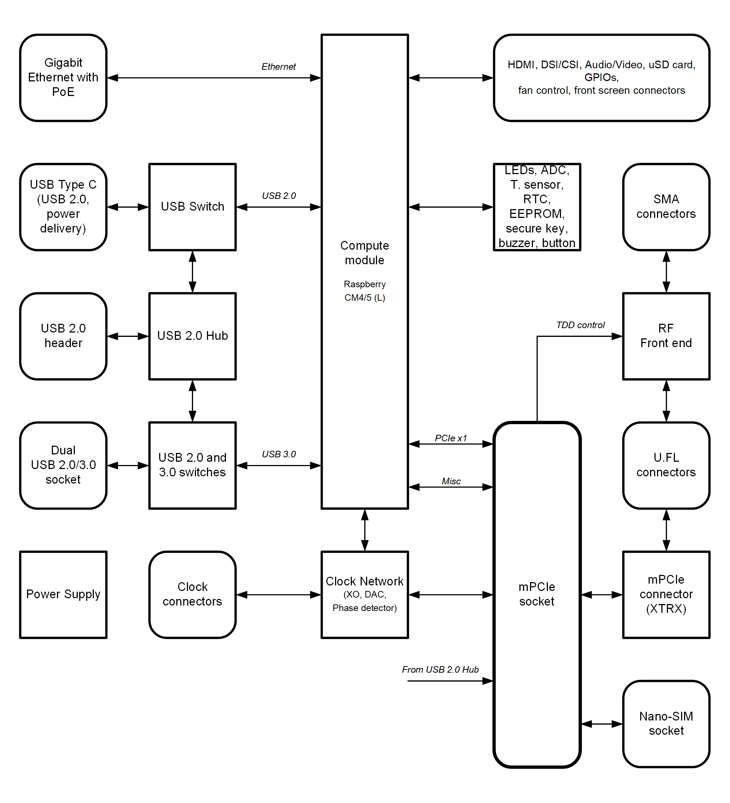
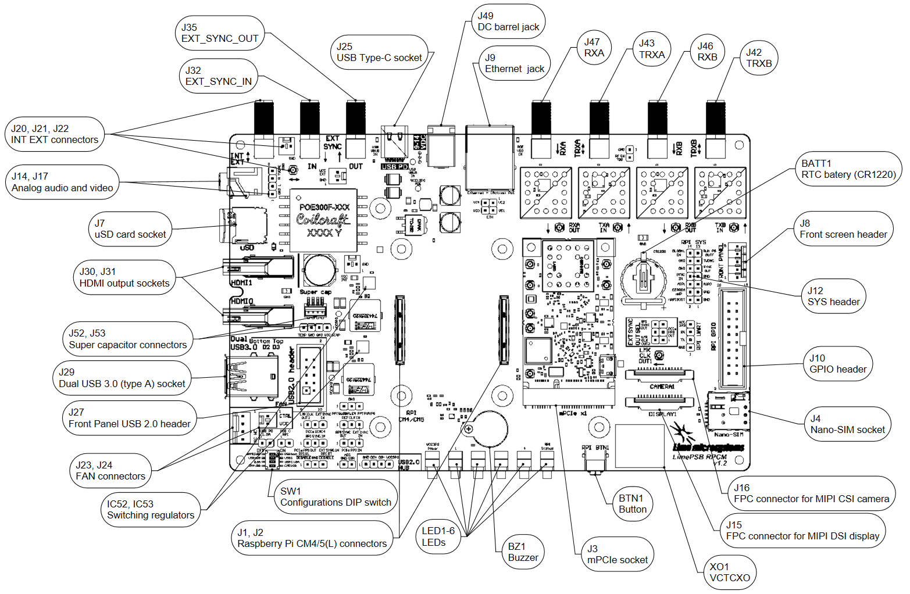
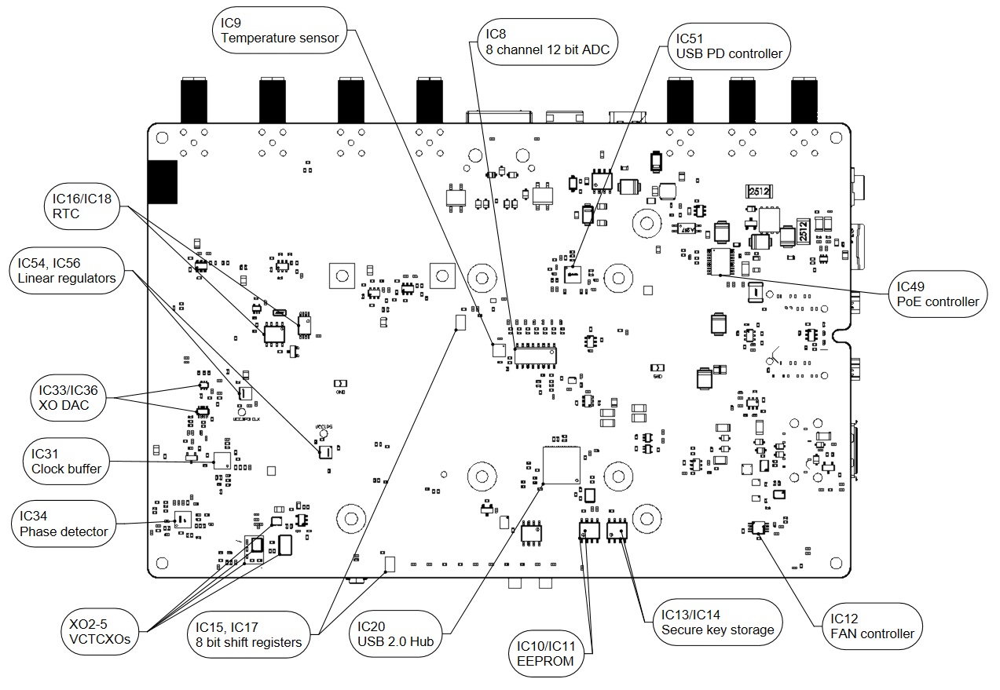

*****
LimePSB RPCM v1.2 Board
*****

Introduction
============

LimePSB RPCM v1.2 Board Key Features
-------------------------------

The LimePSB RPCM is carrier board for Raspberry Pi Compute Module 4 or 5 (CM4 or CM5) and mPCIe card (by default LimeSDR XTRX board). LimePSB RPCM carrier board provides a hardware platform for developing and prototyping high-performance designs based on Raspberry Pi CM4 or CM5, RF front end, clock network and mPCIe card. It allows user to use the board in SDR, LoRa and other applications.

.. figure:: images/LimePSB-RPCM_v1.2_3D_top.png
  :width: 600
  
  Figure 1. LimePSB-RPCM v1.2 board top view

.. figure:: images/LimePSB-RPCM_v1.2_3D_bot.png
  :width: 600
  
  Figure 2. LimePSB-RPCM v1.2 board bottom view

LimePSB RPCM board features:

* Connectors:

  * Raspberry CM4 and CM5 connector (dual row)
  * USB 2.0 Type-C socket (USB boot and power delivery)
  * Dual USB 3.0 (type A) socket (downstream ports) or Front Panel USB 2.0 header (unpopulated)
  * Ethernet jack (Gigabit Ethernet with PoE)
  * mini PCIe x1 Gen 2 (5Gbps)
  * 2x HDMI 2.0 receptacle (up to 4Kp60 supported)
  * 2x 15-pin FPC connectors for MIPI DSI display and CSI camera
  * 3.5 mm 4-pin jack for analog audio and composite video
  * uSD card socket
  * Nano-SIM socket
  * Coaxial RF (4x SMA female + 4x U.FL female) connectors for RF front end
  * Coaxial pass-through U.FL to external SMA connector
  * 20-pin Raspberry CM4 GPIO header (3.3V)
  * 14-pin Raspberry CM4 SYS header
  * 5-pin front display connector (power, I2C, button)
  * Raspberry CM4 UART0 header (unpopulated)
  * 2-pin and 4-pin FAN connector (5V default or 3.3V or VCC_INT voltage)

* RF front end:

  * Configuration: MIMO (2x TRX, 2x RX)
  * LNAs, PAs, RF switches, power and mode control (TDD and FDD)

* Miscellaneous:

  * Board temperature sensor
  * FAN controller
  * EEPROM
  * Secure key storage, shift registers
  * RTC, ADC
  * USB 2.0 hub
  * Configuration dip switch

* General user inputs/outputs:

  * 4x general purpose Dual colour (RG) LEDs 
  * 20 pin CM4/5 GPIO header (3.3V)
  * Front button
  * Buzzer

* Clock system:

  * 30.72MHz (default) on board VCOCXO and 30.72/38.4/40.00MHz (optional) VCTCXOs
  * Possibility to tune on board XO by on-board DAC or by phase detector to match a reference clock input (e.g. 10MHz).
  * Reference clock/PPS input and output SMA connectors (EXT_SYNC_IN and EXT_SYNC_OUT)
  * Possibility to synchronize multiple boards using coaxial SMA connectors  (EXT_SYNC_IN and EXT_SYNC_OUT)

* Board size: 170mm x 110mm

* Board power sources:

  * Barrel (9-14V, 2-3A)
  * USB Power Delivery (12V 1.5A or 2.5A)
  * PoE (12V, 2A)

For more information on the following topics, refer to the folowing documents:

* `Raspberry Pi CM4  <http://datasheets.raspberrypi.com/cm4/cm4-datasheet.pdf>`_
* `Raspberry Pi CM5  <https://pip.raspberrypi.com/categories/944-raspberry-pi-compute-module-5>`_
* `LimeSDR XTRX  <https://limesdr-xtrx.myriadrf.org/>`_

Board Overview
-------------- 

The heart of the LimePSB-RPCM carrier board is Raspberry PI Compute Module 4 or Compute Module 5 which may be used to transfer digital data between the CM4/5 and mPCIe board while performing data processing. The block diagram for LimePSB-RPCM board is as shown in Figure 3.

  
  Figure 3. LimePSB-RPCM v1.2 carrier Board Block Diagram

LimePSB-RPCM board picture with highlighted connectors and main components are presented in Figure 4 and Figure 5. 

  
  Figure 4. LimePSB-RPCM v1.2 board top connectors and main components

.. _target1:

  
  Figure 5. LimePSB-RPCM v1.2 board bottom connectors and main components

Board components are described in the Table 1.

.. table:: Table 1. Board components

+--------------------------------------------------------------------------------------------------------------------------------------------+
| **Miscellaneous devices**                                                                                                                  |
+=================================+============================+=============================================================================+
| IC9                             | IC                         | I²C temperature   sensor LM75                                               |
+---------------------------------+----------------------------+-----------------------------------------------------------------------------+
| IC10/IC11                       | IC                         | I²C   EEPROM Memory 128Kb (16K x 8), connected to RF transceiver I2C bus    |
+---------------------------------+----------------------------+-----------------------------------------------------------------------------+
| IC13/IC14                       | IC                         | I²C   secure key storage                                                    |
+---------------------------------+----------------------------+-----------------------------------------------------------------------------+
| IC16/IC18                       | IC                         | I²C   Real time clock                                                       |
+---------------------------------+----------------------------+-----------------------------------------------------------------------------+
| IC8                             | IC                         | 8   channel 12 bit ADC                                                      |
+---------------------------------+----------------------------+-----------------------------------------------------------------------------+
| IC15,   IC17                    | IC                         | 8 bit   shift register                                                      |
+---------------------------------+----------------------------+-----------------------------------------------------------------------------+
| IC20                            | IC                         | USB2.0 HUB                                                                  |
+---------------------------------+----------------------------+-----------------------------------------------------------------------------+
| IC21, IC26, IC27, IC29, IC30    | IC                         | USB   switch                                                                |
+---------------------------------+----------------------------+-----------------------------------------------------------------------------+
| J24, J23                        | Pin   header               | 2-pin   and 4-pin FAN connector (5V default or 3.3V or VCC_INT voltage)     |
+---------------------------------+----------------------------+-----------------------------------------------------------------------------+
| **Configuration, Status, Setup Elements and GPIOs**                                                                                        |
+---------------------------------+----------------------------+-----------------------------------------------------------------------------+
| LED1,   LED2, LED3, LED4        | Red-green   status LEDs    | User   defined indication LED                                               |
+---------------------------------+----------------------------+-----------------------------------------------------------------------------+
| LED5                            | Red-green   status LEDs    | Raspberry CM4/5 status                                                      |
+---------------------------------+----------------------------+-----------------------------------------------------------------------------+
| LED6                            | Green   status LED         | Power   indication LED                                                      |
+---------------------------------+----------------------------+-----------------------------------------------------------------------------+
| BZ1                             | Buzzer                     | User   defined                                                              |
+---------------------------------+----------------------------+-----------------------------------------------------------------------------+
| J12                             | Header                     | 14-pin Raspberry CM4 SYS header                                             |
+---------------------------------+----------------------------+-----------------------------------------------------------------------------+
| J5                              | Header                     | Power   control and PG status                                               |
+---------------------------------+----------------------------+-----------------------------------------------------------------------------+
| J6                              | Header                     | Wireless   LAN and Bluetooth control                                        |
+---------------------------------+----------------------------+-----------------------------------------------------------------------------+
| J10                             | Header                     | 20-pin   CM4 GPIO header                                                    |
+---------------------------------+----------------------------+-----------------------------------------------------------------------------+
| SW1                             | DIP   switch               | Boot and   USB configuration                                                |
+---------------------------------+----------------------------+-----------------------------------------------------------------------------+
| RF front end                                                                                                                               |
+---------------------------------+----------------------------+-----------------------------------------------------------------------------+
| IC39, IC40                      | IC                         | PA TQP3M9018                                                                |
+---------------------------------+----------------------------+-----------------------------------------------------------------------------+
| IC43, IC44                      | IC                         | LNA   SPF5043Z                                                              |
+---------------------------------+----------------------------+-----------------------------------------------------------------------------+
| IC37, IC38, IC41, IC42          | IC                         | RF   switch SKY13286                                                        |
+---------------------------------+----------------------------+-----------------------------------------------------------------------------+
| **Communication Ports**                                                                                                                    |
+---------------------------------+----------------------------+-----------------------------------------------------------------------------+
| J1, J2                          | Connector                  | Raspberry   Pi CM4(L)/5 connectors                                          |
+---------------------------------+----------------------------+-----------------------------------------------------------------------------+
| J11                             | Header                     | Raspberry   CM4 UART0 header (unpopulated)                                  |
+---------------------------------+----------------------------+-----------------------------------------------------------------------------+
| J8                              | Header                     | 5-pin   front screen connector (power, I2C, button)                         |
+---------------------------------+----------------------------+-----------------------------------------------------------------------------+
| J25                             | USB                        | USB 2.0   (Type-C) socket                                                   |
+---------------------------------+----------------------------+-----------------------------------------------------------------------------+
| J29                             | USB                        | Dual   USB 3.0 (Type-A) socket                                              |
+---------------------------------+----------------------------+-----------------------------------------------------------------------------+
| J9                              | Ethernet                   | Gigabit   RJ45 (Ethernet with magnetics) port                               |
+---------------------------------+----------------------------+-----------------------------------------------------------------------------+
| J30, J31                        | HDMI                       | HDMI 2.0   socket                                                           |
+---------------------------------+----------------------------+-----------------------------------------------------------------------------+
| J15, J16                        | LVDS                       | FPC   15-pin for display and camera                                         |
+---------------------------------+----------------------------+-----------------------------------------------------------------------------+
| J14,   J17                      | Audio/Video                | 3.5 mm   jack, Header (unpopulated)                                         |
+---------------------------------+----------------------------+-----------------------------------------------------------------------------+
| J7                              | SDIO                       | Micro   SD card holder                                                      |
+---------------------------------+----------------------------+-----------------------------------------------------------------------------+
| J4                              | Nano-SIM                   | Nano-SIM   card holder                                                      |
+---------------------------------+----------------------------+-----------------------------------------------------------------------------+
| J3                              | Mini   PCIe                | Mini   PCIe x1 expansion slot                                               |
+---------------------------------+----------------------------+-----------------------------------------------------------------------------+
| **Clock Circuitry**                                                                                                                        |
+---------------------------------+----------------------------+-----------------------------------------------------------------------------+
| XO1                             | VCOCXO                     | 30.72   MHz VCOCXO                                                          |
+---------------------------------+----------------------------+-----------------------------------------------------------------------------+
| XO2                             | VCTCXO                     | 30.72   MHz VCTCXO                                                          |
+---------------------------------+----------------------------+-----------------------------------------------------------------------------+
| XO3                             | VCTCXO                     | 30.72   MHz VCTCXO                                                          |
+---------------------------------+----------------------------+-----------------------------------------------------------------------------+
| XO4                             | VCTCXO                     | 40.00   MHz VCTCXO                                                          |
+---------------------------------+----------------------------+-----------------------------------------------------------------------------+
| XO5                             | VCTCXO                     | 38.40   MHz VCTCXO                                                          |
+---------------------------------+----------------------------+-----------------------------------------------------------------------------+
| IC33   (IC36)                   | IC                         | 16 (8) bit DAC for XOs VC tuning                                            |
+---------------------------------+----------------------------+-----------------------------------------------------------------------------+
| IC35                            | IC                         | RPi sync mux                                                                |
+---------------------------------+----------------------------+-----------------------------------------------------------------------------+
| IC31                            | IC                         | Clock   buffer                                                              |
+---------------------------------+----------------------------+-----------------------------------------------------------------------------+
| IC34                            | IC                         | Phase   detector                                                            |
+---------------------------------+----------------------------+-----------------------------------------------------------------------------+
| J32                             | SMA   connector            | Reference   clock input EXT_SYNC_IN                                         |
+---------------------------------+----------------------------+-----------------------------------------------------------------------------+
| J35                             | SMA   connector            | Reference   clock output EXT_SYNC_OUT                                       |
+---------------------------------+----------------------------+-----------------------------------------------------------------------------+
| J33                             | U.FL   connector           | Reference   clock output                                                    |
+---------------------------------+----------------------------+-----------------------------------------------------------------------------+
| J22/J20,   J21                  | Multiple                   | Internal   connector J20/J22 to external SMA J21                            |
+---------------------------------+----------------------------+-----------------------------------------------------------------------------+
| **Power Supply**                                                                                                                           |
+---------------------------------+----------------------------+-----------------------------------------------------------------------------+
| IC52                            | IC                         | Switching   regulator ADP2386 (3.3V rail)                                   |
+---------------------------------+----------------------------+-----------------------------------------------------------------------------+
| IC53                            | IC                         | Switching   regulator ADP2386 (5.0V rail)                                   |
+---------------------------------+----------------------------+-----------------------------------------------------------------------------+
| IC54                            | IC                         | Linear   regulator AP7361-FGE (3.3V rail)                                   |
+---------------------------------+----------------------------+-----------------------------------------------------------------------------+
| IC56                            | IC                         | Linear   regulator AP7361-FGE (1.5V rail)                                   |
+---------------------------------+----------------------------+-----------------------------------------------------------------------------+
| IC55                            | IC                         | Voltage   reference AS431ANTR-G1 (2.5V rail)                                |
+---------------------------------+----------------------------+-----------------------------------------------------------------------------+