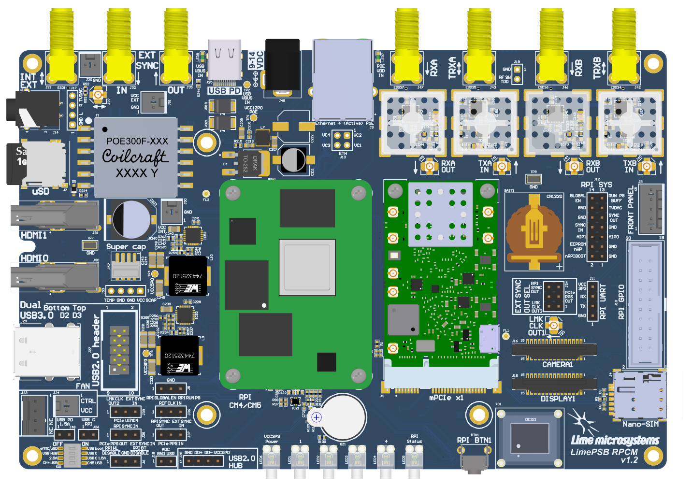
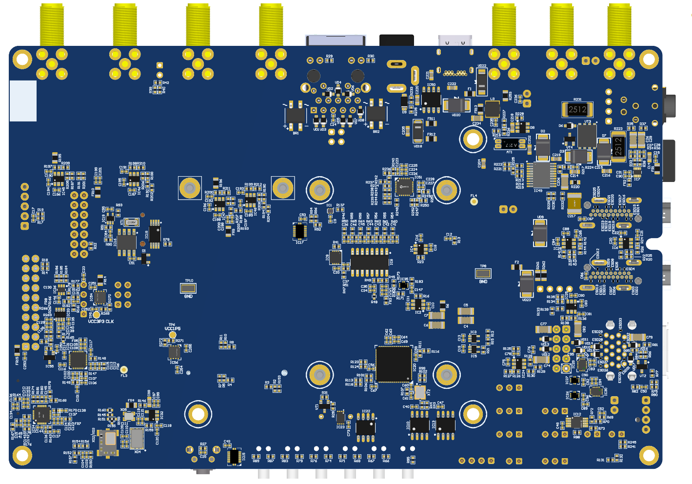

*****
LimePSB RPCM v1.2 Board
*****

Introduction
============

LimePSB RPCM v1.2 Board Key Features
-------------------------------

The LimePSB RPCM is carrier board for Raspberry Pi Compute Module 4 or 5 (CM4 or CM5)  and mPCIe card (by default LimeSDR XTRX board). LimePSB RPCM carrier board provides a hardware platform for developing and prototyping high-performance designs based on Raspberry Pi CM4 or CM5, RF front end, clock network and mPCIe card. It allows user to use the board in SDR, LoRa and other applications.

  
  Figure 1: LimePSB RPCM v1.2 board top view

  
  Figure 2: LimePSB RPCM v1.2 board bottom view
