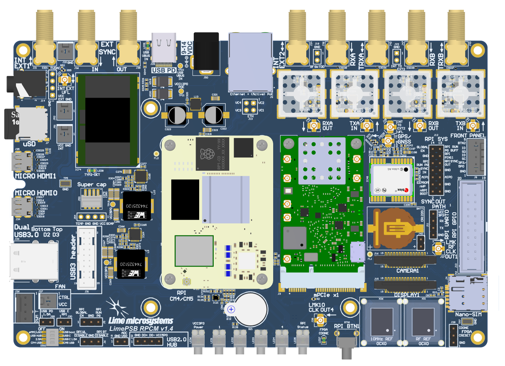
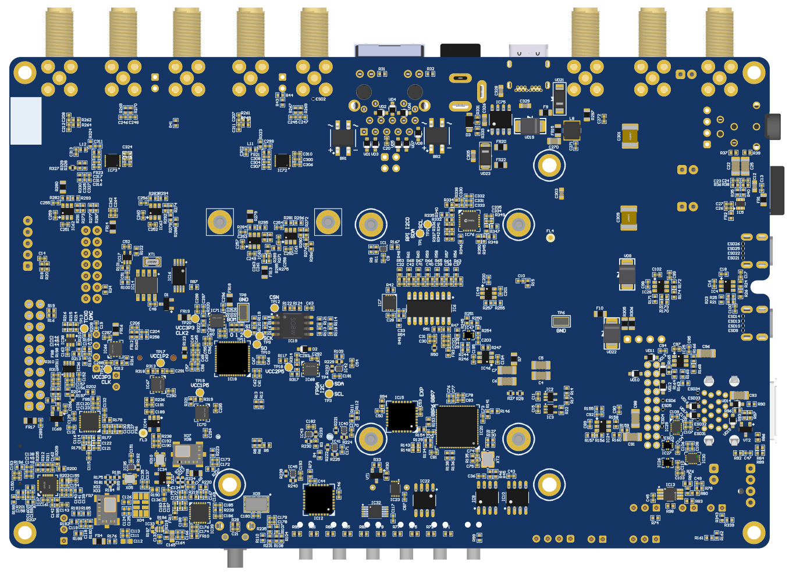
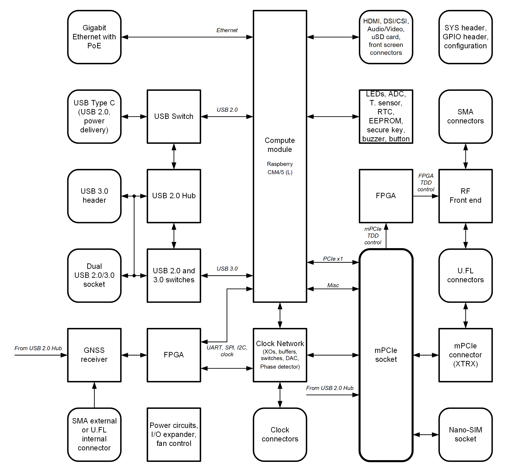
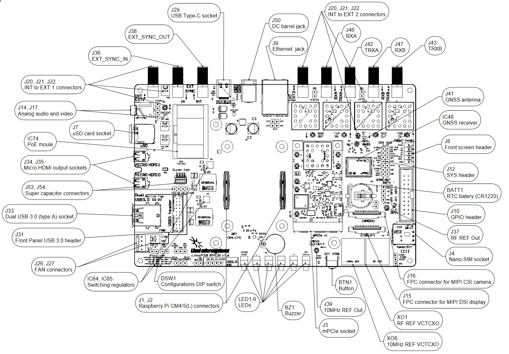
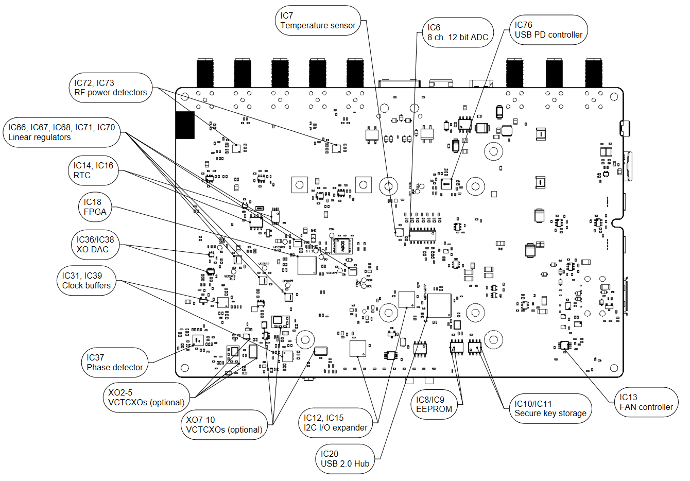
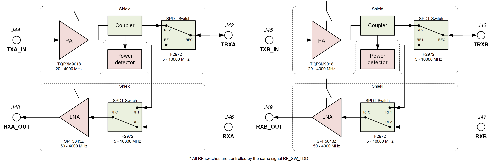
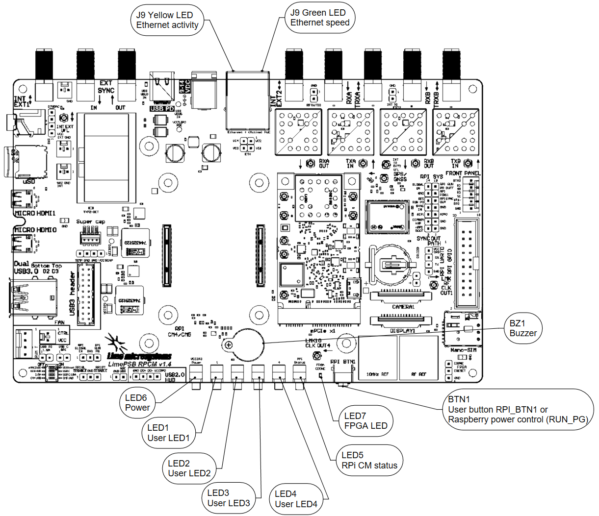
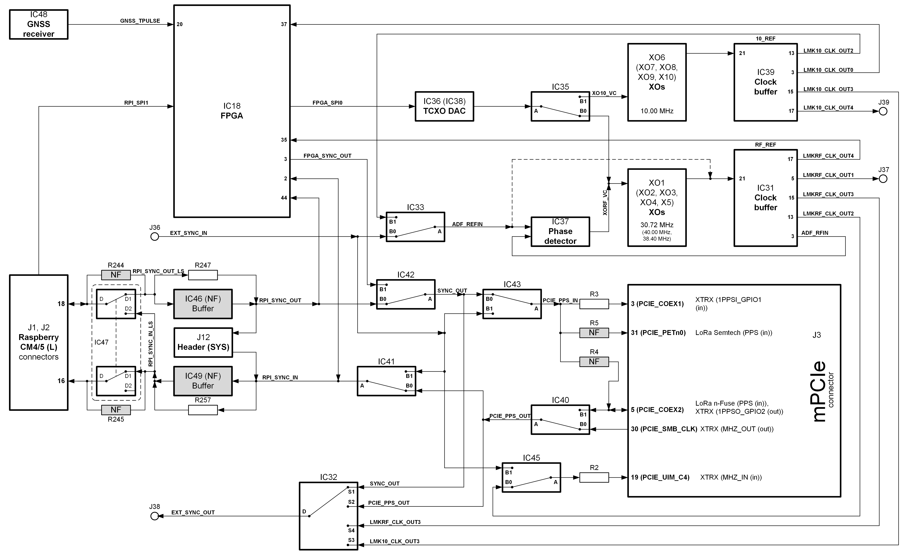
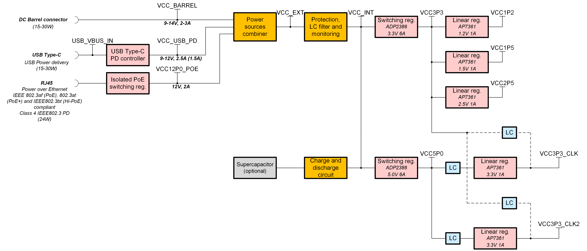

***********************
LimePSB RPCM v1.4 Board
***********************

Introduction
============

LimePSB RPCM v1.4 Board Key Features
------------------------------------

The LimePSB RPCM is carrier board for Raspberry Pi Compute Module 4 or 5 (CM4 or CM5)  and mPCIe card (by default LimeSDR XTRX board). LimePSB RPCM carrier board provides a hardware platform for developing and prototyping high-performance designs based on Raspberry Pi CM4 or CM5, RF front end, clock network and mPCIe card. It allows user to use the board in SDR, LoRa and other applications.

  
  Figure 1: LimePSB RPCM v1.4 board top view

  
  Figure 2: LimePSB RPCM v1.4 board bottom view

  LimePSB RPCM board features:

* Connectors:

  *	Raspberry CM4 and CM5 connector (dual row)
  *	USB 2.0 Type-C socket (USB boot and power delivery)
  *	Dual USB 3.0 (type A) socket and USB header (downstream ports) or Front Panel USB 2.0 header (unpopulated)
  *	Ethernet jack (Gigabit Ethernet with PoE)
  *	mini PCIe x1 Gen 2 (5Gbps)
  *	2x Micro HDMI 2.0 receptacle (up to 4Kp60 supported)
  *	2x 15-pin FPC connectors for MIPI DSI display and CSI camera
  *	3.5 mm 4-pin jack for analog audio and composite video
  *	uSD card socket
  *	Nano-SIM socket
  *	Coaxial RF (4x SMA female + 4x U.FL female) connectors for RF front end
  *	External synchronization (2x SMA female) connectors for input and output
  *	2x Coaxial pass-through U.FL to external SMA connectors
  *	20-pin Raspberry CM4/5 GPIO header (3.3V)
  *	14-pin Raspberry CM4/5 SYS header
  *	5-pin front display connector (power, I2C, button)
  *	Raspberry CM4/5 UART0 header (unpopulated)
  *	2-pin and 4-pin FAN connector (5V default or 3.3V or VCC_INT voltage)

* RF front end:

  * Configuration: MIMO (2x TRX, 2x RX)
  * LNAs, PAs, RF switches, Couplers, TX power detectors, power (ON/OFF) and mode control (TDD and FDD)

* Miscellaneous:

  * o	FPGA Lattice iCE40 Ultra family (iCE5LP4K)
  * Board temperature sensor
  * FAN controller
  * EEPROM
  * Secure key storage, I/O expander
  * RTC, ADC
  * USB 2.0 hub
  * Configuration dip switch

* General user inputs/outputs:

  * 4x general purpose Dual colour (RG) LEDs 
  * 20 pin CM4/5 GPIO header (3.3V)
  * Front button
  * Buzzer

* Clock system:

  * GNSS receiver
  * 30.72MHz and 10 MHz (default) on board VCOCXOs and 30.72/38.4/40.00MHz (optional) VCTCXOs
  * Possibility to tune on board XO by on-board DAC or by phase detector to match a reference clock input (e.g. 10MHz).
  * Reference clock/PPS input and output SMA connectors (EXT_SYNC_IN and EXT_SYNC_OUT)
  * Possibility to synchronize multiple boards using coaxial SMA connectors  (EXT_SYNC_IN and EXT_SYNC_OUT)

* Board power sources:

  * Barrel (9-14V, 2-3A)
  * USB Power Delivery (12V 1.5A or 2.5A)
  * PoE (12V, 2A)

For more information on the following topics, refer to the folowing documents:

* `Raspberry Pi CM4  <http://datasheets.raspberrypi.com/cm4/cm4-datasheet.pdf>`_
* `Raspberry Pi CM5  <https://pip.raspberrypi.com/categories/944-raspberry-pi-compute-module-5>`_
* `LimeSDR XTRX  <https://limesdr-xtrx.myriadrf.org/>`_

Board Overview
-------------- 

he heart of the LimePSB RPCM carrier board is Raspberry PI Compute Module 4 or Compute Module 5 which may be used to transfer digital data between the CM4/5 and mPCIe board while performing data processing. The block diagram for LimePSB RPCM board is as shown in Figure 3.

  
  Figure 3. LimePSB RPCM v1.4 carrier Board Block Diagram

LimePSB RPCM board picture with highlighted connectors and main components are presented in Figure 4 and Figure 5. 

  
  Figure 4. LimePSB RPCM v1.4 board top connectors and main components

.. _target1:

  
  Figure 5. LimePSB RPCM v1.4 board bottom connectors and main components

Board components are described in the Table 1.

.. table:: Table 1. Board components

  +---------------------------------------------------------------------------------------------------------------------------------+
  | **Miscellaneous   devices**                                                                                                     |
  +==============================+=======================+==========================================================================+
  | **Board Reference**          | **Type**              | **Description**                                                          |
  +------------------------------+-----------------------+--------------------------------------------------------------------------+
  | IC18                         | FPGA                  | Lattice iCE40 Ultra family (iCE5LP4K)                                    |
  +------------------------------+-----------------------+--------------------------------------------------------------------------+
  | IC19                         | IC                    | FPGA configuration flash (16 MBIT)                                       |
  +------------------------------+-----------------------+--------------------------------------------------------------------------+
  | IC7                          | IC                    | I²C temperature sensor LM75                                              |
  +------------------------------+-----------------------+--------------------------------------------------------------------------+
  | IC8/IC9                      | IC                    | I²C EEPROM Memory 128Kb (16K x 8), connected   to RF transceiver I2C bus |
  +------------------------------+-----------------------+--------------------------------------------------------------------------+
  | IC10/IC11                    | IC                    | I²C secure key storage                                                   |
  +------------------------------+-----------------------+--------------------------------------------------------------------------+
  | IC14/IC16                    | IC                    | I²C Real time clock                                                      |
  +------------------------------+-----------------------+--------------------------------------------------------------------------+
  | IC6                          | IC                    | 8 channel 12 bit ADC                                                     |
  +------------------------------+-----------------------+--------------------------------------------------------------------------+
  | IC12, IC15                   | IC                    | I²C I/O expander                                                         |
  +------------------------------+-----------------------+--------------------------------------------------------------------------+
  | IC20                         | IC                    | USB2.0 HUB                                                               |
  +------------------------------+-----------------------+--------------------------------------------------------------------------+
  | IC21, IC26, IC27, IC29, IC30 | IC                    | USB switch                                                               |
  +------------------------------+-----------------------+--------------------------------------------------------------------------+
  | J27, J26                     | Pin header            | 2-pin and 4-pin FAN connector (5V default or   3.3V or VCC_INT voltage)  |
  +------------------------------+-----------------------+--------------------------------------------------------------------------+
  | **Configuration,   Status, Setup Elements and GPIOs**                                                                           |
  +------------------------------+-----------------------+--------------------------------------------------------------------------+
  | LED1, LED2, LED3, LED4       | Red-green status LEDs | User defined indication LED                                              |
  +------------------------------+-----------------------+--------------------------------------------------------------------------+
  | LED5                         | Red-green status LEDs | Raspberry CM4/5 status                                                   |
  +------------------------------+-----------------------+--------------------------------------------------------------------------+
  | LED6                         | Green status LED      | Power indication LED                                                     |
  +------------------------------+-----------------------+--------------------------------------------------------------------------+
  | LED7                         | Red-green status LEDs | FPGA status                                                              |
  +------------------------------+-----------------------+--------------------------------------------------------------------------+
  | BZ1                          | Buzzer                | User defined                                                             |
  +------------------------------+-----------------------+--------------------------------------------------------------------------+
  | J12                          | Header                | 14-pin Raspberry CM4 SYS header                                          |
  +------------------------------+-----------------------+--------------------------------------------------------------------------+
  | J5                           | Header                | Power control and PG status                                              |
  +------------------------------+-----------------------+--------------------------------------------------------------------------+
  | J6                           | Header                | Wireless LAN and Bluetooth control                                       |
  +------------------------------+-----------------------+--------------------------------------------------------------------------+
  | J10                          | Header                | 20-pin CM4 GPIO header                                                   |
  +------------------------------+-----------------------+--------------------------------------------------------------------------+
  | J28                          | Header                | FPGA configuration                                                       |
  +------------------------------+-----------------------+--------------------------------------------------------------------------+
  | DSW1                         | DIP switch            | Boot and USB configuration                                               |
  +------------------------------+-----------------------+--------------------------------------------------------------------------+
  | **RF   front end**                                                                                                              |
  +------------------------------+-----------------------+--------------------------------------------------------------------------+
  | IC52, IC54                   | IC                    | PA TQP3M9018                                                             |
  +------------------------------+-----------------------+--------------------------------------------------------------------------+
  | IC58, IC59                   | IC                    | LNA SPF5043Z                                                             |
  +------------------------------+-----------------------+--------------------------------------------------------------------------+
  | IC50, IC51, IC56, IC57       | IC                    | RF switch F2972NEGK                                                      |
  +------------------------------+-----------------------+--------------------------------------------------------------------------+
  | IC53, IC55                   | IC                    | Coupler HHM22152A2                                                       | 
  +------------------------------+-----------------------+--------------------------------------------------------------------------+
  | IC72, IC73                   | IC                    | RF power detector LTC5587                                                |         
  +------------------------------+-----------------------+--------------------------------------------------------------------------+
  | **Communication   Ports**                                                                                                       |
  +------------------------------+-----------------------+--------------------------------------------------------------------------+
  | J1, J2                       | Connector             | Raspberry Pi CM4(L)/5 connectors                                         |
  +------------------------------+-----------------------+--------------------------------------------------------------------------+
  | J11                          | Header                | Raspberry CM4/5 UART0 header (unpopulated)                               |
  +------------------------------+-----------------------+--------------------------------------------------------------------------+
  | J8                           | Header                | 5-pin front screen connector (power, I2C, button)                        |
  +------------------------------+-----------------------+--------------------------------------------------------------------------+
  | J29                          | USB                   | USB 2.0 (Type-C) socket                                                  |
  +------------------------------+-----------------------+--------------------------------------------------------------------------+
  | J33                          | USB                   | Dual USB 3.0 (Type-A) socket                                             |
  +------------------------------+-----------------------+--------------------------------------------------------------------------+
  | J9                           | Ethernet              | Gigabit RJ45 (Ethernet with magnetics) port                              |
  +------------------------------+-----------------------+--------------------------------------------------------------------------+
  | J34, J35                     | HDMI                  | HDMI 2.0 socket                                                          |
  +------------------------------+-----------------------+--------------------------------------------------------------------------+
  | J15, J16                     | LVDS                  | FPC 15-pin for display and camera                                        |
  +------------------------------+-----------------------+--------------------------------------------------------------------------+
  | J14, J17                     | Audio/Video           | 3.5 mm jack, Header (unpopulated)                                        |
  +------------------------------+-----------------------+--------------------------------------------------------------------------+
  | J7                           | SDIO                  | Micro SD card holder                                                     |
  +------------------------------+-----------------------+--------------------------------------------------------------------------+
  | J4                           | Nano-SIM              | Nano-SIM card holder                                                     |
  +------------------------------+-----------------------+--------------------------------------------------------------------------+
  | J3                           | Mini PCIe             | Mini PCIe x1 expansion slot                                              |
  +------------------------------+-----------------------+--------------------------------------------------------------------------+
  | **Clock   Circuitry**                                                                                                           |
  +------------------------------+-----------------------+--------------------------------------------------------------------------+
  | XO1                          | VCOCXO                | 30.72 MHz VCOCXO                                                         |
  +------------------------------+-----------------------+--------------------------------------------------------------------------+
  | XO6                          | VCOCXO                | 10 MHz VCOCXO                                                            |
  +------------------------------+-----------------------+--------------------------------------------------------------------------+
  | XO2, XO7                     | VCTCXO                | 30.72 MHz VCTCXO                                                         |
  +------------------------------+-----------------------+--------------------------------------------------------------------------+
  | XO3, XO8                     | VCTCXO                | 30.72 MHz VCTCXO                                                         |
  +------------------------------+-----------------------+--------------------------------------------------------------------------+
  | XO4, XO9                     | VCTCXO                | 40.00 MHz VCTCXO                                                         |
  +------------------------------+-----------------------+--------------------------------------------------------------------------+
  | XO5, XO10                    | VCTCXO                | 38.40 MHz VCTCXO                                                         |
  +------------------------------+-----------------------+--------------------------------------------------------------------------+
  | IC48                         | IC                    | GNSS receiver                                                            |
  +------------------------------+-----------------------+--------------------------------------------------------------------------+
  | IC36 (IC38)                  | IC                    | 16 (8) bit DAC for XOs VC tuning                                         |
  +------------------------------+-----------------------+--------------------------------------------------------------------------+
  | IC47                         | IC                    | RPi sync mux                                                             |
  +------------------------------+-----------------------+--------------------------------------------------------------------------+
  | IC31, IC39                   | IC                    | Clock buffer                                                             |
  +------------------------------+-----------------------+--------------------------------------------------------------------------+
  | IC37                         | IC                    | Phase detector                                                           |
  +------------------------------+-----------------------+--------------------------------------------------------------------------+
  | J36                          | SMA connector         | Reference clock input EXT_SYNC_IN                                        |
  +------------------------------+-----------------------+--------------------------------------------------------------------------+
  | J38                          | SMA connector         | Reference clock output EXT_SYNC_OUT                                      |
  +------------------------------+-----------------------+--------------------------------------------------------------------------+
  | J37, J39                     | U.FL connector        | Reference clock output                                                   |
  +------------------------------+-----------------------+--------------------------------------------------------------------------+
  | J20/J22, J23/25, J21, J24    | Multiple              | Internal U.FL connectors J20/J22, J23/J25 to external SMA J21, J24       |
  +------------------------------+-----------------------+--------------------------------------------------------------------------+
  | J41                          | U.FL connector        | External GNSS antenna                                                    |
  +------------------------------+-----------------------+--------------------------------------------------------------------------+
  | IC33, IC32, IC35, IC40,      | IC                    | Clock signal analog mux                                                  |
  | IC41, IC42, IC43, IC45       |                       |                                                                          |
  +------------------------------+-----------------------+--------------------------------------------------------------------------+
  | **Power   Supply**                                                                                                              |
  +------------------------------+-----------------------+--------------------------------------------------------------------------+
  | IC64                         | IC                    | Switching regulator ADP2386 (3.3V rail)                                  |
  +------------------------------+-----------------------+--------------------------------------------------------------------------+
  | IC65                         | IC                    | Switching regulator ADP2386 (5.0V rail)                                  |
  +------------------------------+-----------------------+--------------------------------------------------------------------------+
  | IC66, IC71                   | IC                    | Linear regulator AP7361-FGE (3.3V rail)                                  |
  +------------------------------+-----------------------+--------------------------------------------------------------------------+
  | IC68                         | IC                    | Linear regulator AP7361-FGE (2.5V rail)                                  |
  +------------------------------+-----------------------+--------------------------------------------------------------------------+
  | IC70                         | IC                    | Linear regulator AP7361-FGE (1.5V rail)                                  |
  +------------------------------+-----------------------+--------------------------------------------------------------------------+
  | IC67                         | IC                    | Linear regulator AP7361-FGE (1.2V rail)                                  |
  +------------------------------+-----------------------+--------------------------------------------------------------------------+
  | IC69                         | IC                    | Voltage reference AS431ANTR-G1 (2.5V rail)                               |
  +------------------------------+-----------------------+--------------------------------------------------------------------------+
  | IC76                         | IC                    | USB power delivery controller CYPD3177-24LQXQT                           |
  +------------------------------+-----------------------+--------------------------------------------------------------------------+
  | IC74                         | IC                    | Power over Ethernet controller AG5712-LPB                                |
  +------------------------------+-----------------------+--------------------------------------------------------------------------+

LimePSB RPCM Board Architecture
===============================

This chapter is dedicated for detailed description of LimePSB RPCM board components and interconnections.

Raspberry CM4/5 Connector
-------------------------

LimePSB RPCM board is designed to use Raspberry Pi CM4/5 as a host computer. Raspberry Pi CM4/5L version without eMMC Flash memory is also supported. Board to board connectors (J1 and J2) are used to connect CM4/5 to the LimePSB RPCM board. Connector pinout, CM4 and CM5 signals and schematic signal names are listed and described in Table 2.

.. tab:: Raspberry Pi Compute Module 4 connector pinout

  .. table:: Table 2. Raspberry Pi Compute Module 4 connector pinout

    +----------+---------------------+-----------------------+----------------------------------------+
    | CM4 Pin  | CM4 reference       | Schematic signal name | Description [1]                        |
    +----------+---------------------+-----------------------+----------------------------------------+
    | 1        | GND                 | GND                   | Ground (0V)                            |
    +----------+---------------------+-----------------------+----------------------------------------+
    | 2        | GND                 | GND                   | Ground (0V)                            |
    +----------+---------------------+-----------------------+----------------------------------------+
    | 3        | Ethernet_Pair3_P    | ETH_TRD3_P            | Ethernet pair 3 positive               |
    +----------+---------------------+-----------------------+----------------------------------------+
    | 4        | Ethernet_Pair1_P    | ETH_TRD1_P            | Ethernet pair 1 positive               |
    +----------+---------------------+-----------------------+----------------------------------------+
    | 5        | Ethernet_Pair3_N    | ETH_TRD3_N            | Ethernet pair 3 negative               |
    +----------+---------------------+-----------------------+----------------------------------------+
    | 6        | Ethernet_Pair1_N    | ETH_TRD1_N            | Ethernet pair 1 negative               |
    +----------+---------------------+-----------------------+----------------------------------------+
    | 7        | GND                 | GND                   | Ground (0V)                            |
    +----------+---------------------+-----------------------+----------------------------------------+
    | 8        | GND                 | GND                   | Ground (0V)                            |
    +----------+---------------------+-----------------------+----------------------------------------+
    | 9        | Ethernet_Pair2_N    | ETH_TRD2_N            | Ethernet pair 2 negative               |
    +----------+---------------------+-----------------------+----------------------------------------+
    | 10       | Ethernet_Pair0_N    | ETH_TRD0_N            | Ethernet pair 0 negative               |
    +----------+---------------------+-----------------------+----------------------------------------+
    | 11       | Ethernet_Pair2_P    | ETH_TRD2_P            | Ethernet pair 2 positive               |
    +----------+---------------------+-----------------------+----------------------------------------+
    | 12       | Ethernet_Pair0_P    | ETH_TRD0_P            | Ethernet pair 0 positive               |
    +----------+---------------------+-----------------------+----------------------------------------+
    | 13       | GND                 | GND                   | Ground (0V)                            |
    +----------+---------------------+-----------------------+----------------------------------------+
    | 14       | GND                 | GND                   | Ground (0V)                            |
    +----------+---------------------+-----------------------+----------------------------------------+
    | 15       | Ethernet_nLED3      | ETH_LED_Y             | Ethernet activity indicator            |
    +----------+---------------------+-----------------------+----------------------------------------+
    | 16       | Ethernet_SYNC_IN    | RPI_PIN16             | IEEE1588 SYNC Input                    |
    +----------+---------------------+-----------------------+----------------------------------------+
    | 17       | Ethernet_nLED2      | ETH_LED_G             | Ethernet speed indicator               |
    +----------+---------------------+-----------------------+----------------------------------------+
    | 18       | Ethernet_SYNC_OUT   | RPI_PIN18             | IEEE1588 SYNC Output                   |
    +----------+---------------------+-----------------------+----------------------------------------+
    | 19       | Ethernet_nLED1      | NC                    | Ethernet speed indicator               |
    +----------+---------------------+-----------------------+----------------------------------------+
    | 20       | EEPROM_nWP          | RPI_EEPROM_nWP        | EEPROM write   protect                 |
    +----------+---------------------+-----------------------+----------------------------------------+
    | 21       | Pi_nLED_Activity    | RPI_STATUS_LED_R      | Pi activity LED                        |
    +----------+---------------------+-----------------------+----------------------------------------+
    | 22       | GND                 | GND                   | Ground (0V)                            |
    +----------+---------------------+-----------------------+----------------------------------------+
    | 23       | GND                 | GND                   | Ground (0V)                            |
    +----------+---------------------+-----------------------+----------------------------------------+
    | 24       | GPIO26              | RFPDB_CONV            | General   purpose                      |
    +----------+---------------------+-----------------------+----------------------------------------+
    | 25       | GPIO21              | RPI_SPI1_SCLK         | General   purpose                      |
    +----------+---------------------+-----------------------+----------------------------------------+
    | 26       | GPIO19              | RPI_SPI1_MISO         | General   purpose                      |
    +----------+---------------------+-----------------------+----------------------------------------+
    | 27       | GPIO20              | RPI_SPI1_MOSI         | General   purpose                      |
    +----------+---------------------+-----------------------+----------------------------------------+
    | 28       | GPIO13              | RPI_PWM1              | General   purpose                      |
    +----------+---------------------+-----------------------+----------------------------------------+
    | 29       | GPIO16              | RPI_SPI1_SS2          | General   purpose                      |
    +----------+---------------------+-----------------------+----------------------------------------+
    | 30       | GPIO6               | RPI_GPIO6             | General   purpose                      |
    +----------+---------------------+-----------------------+----------------------------------------+
    | 31       | GPIO12              | RPI_PWM0              | General   purpose                      |
    +----------+---------------------+-----------------------+----------------------------------------+
    | 32       | GND                 | GND                   | Ground (0V)                            |
    +----------+---------------------+-----------------------+----------------------------------------+
    | 33       | GND                 | GND                   | Ground (0V)                            |
    +----------+---------------------+-----------------------+----------------------------------------+
    | 34       | GPIO5               | BUZZER                | General   purpose                      |
    +----------+---------------------+-----------------------+----------------------------------------+
    | 35       | ID_SC               | RPI_ID_SC             | BCM2711 GPIO 1                         |
    +----------+---------------------+-----------------------+----------------------------------------+
    | 36       | ID_SD               | RPI_ID_SD             | BCM2711 GPIO 0                         |
    +----------+---------------------+-----------------------+----------------------------------------+
    | 37       | GPIO7               | RPI_SPI0_SS1          | General   purpose                      |
    +----------+---------------------+-----------------------+----------------------------------------+
    | 38       | GPIO11              | RPI_SPI0_SCLK         | General   purpose                      |
    +----------+---------------------+-----------------------+----------------------------------------+
    | 39       | GPIO8               | RPI_SPI0_SS0          | General   purpose                      |
    +----------+---------------------+-----------------------+----------------------------------------+
    | 40       | GPIO9               | RPI_SPI0_MISO         | General   purpose                      |
    +----------+---------------------+-----------------------+----------------------------------------+
    | 41       | GPIO25              | RFPDA_CONV            | General   purpose                      |
    +----------+---------------------+-----------------------+----------------------------------------+
    | 42       | GND                 | GND                   | Ground (0V)                            |
    +----------+---------------------+-----------------------+----------------------------------------+
    | 43       | GND                 | GND                   | Ground (0V)                            |
    +----------+---------------------+-----------------------+----------------------------------------+
    | 44       | GPIO10              | RPI_SPI0_MOSI         | General   purpose                      |
    +----------+---------------------+-----------------------+----------------------------------------+
    | 45       | GPIO24              | RPI_BTN1              | General   purpose                      |
    +----------+---------------------+-----------------------+----------------------------------------+
    | 46       | GPIO22              | RPI_GPIO22            | General   purpose                      |
    +----------+---------------------+-----------------------+----------------------------------------+
    | 47       | GPIO23              | RPI_BTN2              | General   purpose                      |
    +----------+---------------------+-----------------------+----------------------------------------+
    | 48       | GPIO27              | RPI_GPIO27            | General   purpose                      |
    +----------+---------------------+-----------------------+----------------------------------------+
    | 49       | GPIO18              | RPI_SPI1_SS0          | General   purpose                      |
    +----------+---------------------+-----------------------+----------------------------------------+
    | 50       | GPIO17              | RPI_SPI1_SS1          | General   purpose                      |
    +----------+---------------------+-----------------------+----------------------------------------+
    | 51       | GPIO15              | RPI_UART0_RX          | General   purpose                      |
    +----------+---------------------+-----------------------+----------------------------------------+
    | 52       | GND                 | GND                   | Ground (0V)                            |
    +----------+---------------------+-----------------------+----------------------------------------+
    | 53       | GND                 | GND                   | Ground (0V)                            |
    +----------+---------------------+-----------------------+----------------------------------------+
    | 54       | GPIO4               | RPI_GPIO4             | General   purpose                      |
    +----------+---------------------+-----------------------+----------------------------------------+
    | 55       | GPIO14              | RPI_UART0_TX          | General   purpose                      |
    +----------+---------------------+-----------------------+----------------------------------------+
    | 56       | GPIO3               | RPI_GPIO3             | General   purpose                      |
    +----------+---------------------+-----------------------+----------------------------------------+
    | 57       | SD_CLK              | RPI_SD_CLK            | SD card clock signal                   |
    +----------+---------------------+-----------------------+----------------------------------------+
    | 58       | GPIO2               | RPI_GPIO2             | General   purpose                      |
    +----------+---------------------+-----------------------+----------------------------------------+
    | 59       | GND                 | GND                   | Ground (0V)                            |
    +----------+---------------------+-----------------------+----------------------------------------+
    | 60       | GND                 | GND                   | Ground (0V)                            |
    +----------+---------------------+-----------------------+----------------------------------------+
    | 61       | SD_DAT3             | RPI_SD_D3             | SD card/eMMC Data3 signal              |
    +----------+---------------------+-----------------------+----------------------------------------+
    | 62       | SD_CMD              | RPI_SD_CMD            | SD card/eMMC Command signal            |
    +----------+---------------------+-----------------------+----------------------------------------+
    | 63       | SD_DAT0             | RPI_SD_D0             | SD card/eMMC Data0 signal              |
    +----------+---------------------+-----------------------+----------------------------------------+
    | 64       | SD_DAT5             | NC                    | SD card/eMMC Data5 signal              |
    +----------+---------------------+-----------------------+----------------------------------------+
    | 65       | GND                 | GND                   | Ground (0V)                            |
    +----------+---------------------+-----------------------+----------------------------------------+
    | 66       | GND                 | GND                   | Ground (0V)                            |
    +----------+---------------------+-----------------------+----------------------------------------+
    | 67       | SD_DAT1             | RPI_SD_D1             | SD card/eMMC Data1 signal              |
    +----------+---------------------+-----------------------+----------------------------------------+
    | 68       | SD_DAT4             | NC                    | SD card/eMMC Data4 signal              |
    +----------+---------------------+-----------------------+----------------------------------------+
    | 69       | SD_DAT2             | RPI_SD_D2             | SD card/eMMC Data2 signal              |
    +----------+---------------------+-----------------------+----------------------------------------+
    | 70       | SD_DAT7             | NC                    | SD card/eMMC Data7 signal              |
    +----------+---------------------+-----------------------+----------------------------------------+
    | 71       | GND                 | GND                   | Ground (0V)                            |
    +----------+---------------------+-----------------------+----------------------------------------+
    | 72       | SD_DAT6             | NC                    | SD card/eMMC Data6 signal              |
    +----------+---------------------+-----------------------+----------------------------------------+
    | 73       | SD_VDD_Override     | NC                    | Force SD card/eMMC interface           |
    +----------+---------------------+-----------------------+----------------------------------------+
    | 74       | GND                 | GND                   | Ground (0V)                            |
    +----------+---------------------+-----------------------+----------------------------------------+
    | 75       | SD_PWR_ON           | RPI_SD_PWR_ON         | Output to power-switch for the SD card |
    +----------+---------------------+-----------------------+----------------------------------------+
    | 76       | Reserved            | RPI_VBAT              | Do not connect                         |
    +----------+---------------------+-----------------------+----------------------------------------+
    | 77       | +5V (Input)         | VCC5P0                | 4.75V-5.25V. Main power input          |
    +----------+---------------------+-----------------------+----------------------------------------+
    | 78       | GPIO_VREF           | VCC3P3                | GPIO   reference voltage               |
    +----------+---------------------+-----------------------+----------------------------------------+
    | 79       | +5V (Input)         | VCC5P0                | 4.75V-5.25V. Main power input          |
    +----------+---------------------+-----------------------+----------------------------------------+
    | 80       | SCL0                | RPI_I2C0_SCL          | I2C clock pin                          |
    +----------+---------------------+-----------------------+----------------------------------------+
    | 81       | +5V (Input)         | VCC5P0                | 4.75V-5.25V. Main power input          |
    +----------+---------------------+-----------------------+----------------------------------------+
    | 82       | SDA0                | RPI_I2C0_SDA          | I2C Data pin                           |
    +----------+---------------------+-----------------------+----------------------------------------+
    | 83       | +5V (Input)         | VCC5P0                | 4.75V-5.25V. Main power input          |
    +----------+---------------------+-----------------------+----------------------------------------+
    | 84       | CM4_3.3V   (Output) | VCC3P3_RPI            | 3.3V ± 2.5%. Power Output              |
    +----------+---------------------+-----------------------+----------------------------------------+
    | 85       | +5V (Input)         | VCC5P0                | 4.75V-5.25V. Main power input          |
    +----------+---------------------+-----------------------+----------------------------------------+
    | 86       | CM4_3.3V   (Output) | VCC3P3_RPI            | 3.3V ± 2.5%. Power Output              |
    +----------+---------------------+-----------------------+----------------------------------------+
    | 87       | +5V (Input)         | VCC5P0                | 4.75V-5.25V. Main power input          |
    +----------+---------------------+-----------------------+----------------------------------------+
    | 88       | CM4_1.8V   (Output) | VCC1P8_RPI            | 1.8V ± 2.5%. Power Output              |
    +----------+---------------------+-----------------------+----------------------------------------+
    | 89       | WL_nDisable         | RPI_WL_nDISABLE       | Wireless   interface disable           |
    +----------+---------------------+-----------------------+----------------------------------------+
    | 90       | CM4_1.8V   (Output) | VCC1P8_RPI            | 1.8V ± 2.5%. Power Output              |
    +----------+---------------------+-----------------------+----------------------------------------+
    | 91       | BT_nDisable         | RPI_BT_nDISABLE       | Bluetooth interface disable            |
    +----------+---------------------+-----------------------+----------------------------------------+
    | 92       | RUN_PG              | RPI_RUN_PG            | CM4 CPU reset/power good               |
    +----------+---------------------+-----------------------+----------------------------------------+
    | 93       | nRPIBOOT            | RPI_nRPIBOOT          | booting from an RPI server             |
    +----------+---------------------+-----------------------+----------------------------------------+
    | 94       | AnalogIP1           | RPI_AIP1              | Analogue input                         |
    +----------+---------------------+-----------------------+----------------------------------------+
    | 95       | PI_LED_nPWR         | RPI_LED_nPWR          | Power On LED                           |
    +----------+---------------------+-----------------------+----------------------------------------+
    | 96       | AnalogIP0           | RPI_AIP0              | Analogue input                         |
    +----------+---------------------+-----------------------+----------------------------------------+
    | 97       | Camera_GPIO         | CAM1_GPIO0            | Used to shut down the camera           |
    +----------+---------------------+-----------------------+----------------------------------------+
    | 98       | GND                 | GND                   | Ground (0V)                            |
    +----------+---------------------+-----------------------+----------------------------------------+
    | 99       | GLOBAL_EN           | RPI_GLOBAL_EN         | CM4 enable                             |
    +----------+---------------------+-----------------------+----------------------------------------+
    | 100      | nEXTRST             | RPI_nEXTRST           | Output. Driven low during reset        |
    +----------+---------------------+-----------------------+----------------------------------------+
    | 101      | USB_OTG_ID          | RPI_USB_OTG_ID        | USB OTG Pin                            |
    +----------+---------------------+-----------------------+----------------------------------------+
    | 102      | PCIe_CLK_nREQ       | RPI_PCIE_CLK_nREQ     | PCIe clock request                     |
    +----------+---------------------+-----------------------+----------------------------------------+
    | 103      | USB_N               | RPI_USB_D_N           | USB D-                                 |
    +----------+---------------------+-----------------------+----------------------------------------+
    | 104      | Reserved            | NC                    | Do not connect                         |
    +----------+---------------------+-----------------------+----------------------------------------+
    | 105      | USB_P               | RPI_USB_D_P           | USB D+                                 |
    +----------+---------------------+-----------------------+----------------------------------------+
    | 106      | Reserved            | RPI_PCIE_DET_nWAKE    | Do not connect                         |
    +----------+---------------------+-----------------------+----------------------------------------+
    | 107      | GND                 | GND                   | Ground (0V)                            |
    +----------+---------------------+-----------------------+----------------------------------------+
    | 108      | GND                 | GND                   | Ground (0V)                            |
    +----------+---------------------+-----------------------+----------------------------------------+
    | 109      | PCIe_nRST           | RPI_PCIE_nRST         | PCIe reset                             |
    +----------+---------------------+-----------------------+----------------------------------------+
    | 110      | PCIe_CLK_P          | RPI_PCIE_CLK_P        | PCIe clock Out positive                |
    +----------+---------------------+-----------------------+----------------------------------------+
    | 111      | VDAC_COMP           | RPI_PIN11             | Video DAC output                       |
    +----------+---------------------+-----------------------+----------------------------------------+
    | 112      | PCIe_CLK_N          | RPI_PCIE_CLK_N        | PCIe clock Out negative                |
    +----------+---------------------+-----------------------+----------------------------------------+
    | 113      | GND                 | GND                   | Ground (0V)                            |
    +----------+---------------------+-----------------------+----------------------------------------+
    | 114      | GND                 | GND                   | Ground (0V)                            |
    +----------+---------------------+-----------------------+----------------------------------------+
    | 115      | CAM1_D0_N           | CAM1_D0_N             | Input Camera1 D0 negative              |
    +----------+---------------------+-----------------------+----------------------------------------+
    | 116      | PCIe_RX_P           | RPI_PCIE_RX_P         | Input PCIe GEN 2 RX positive           |
    +----------+---------------------+-----------------------+----------------------------------------+
    | 117      | CAM1_D0_P           | CAM1_D0_P             | Input Camera1 D0 positive              |
    +----------+---------------------+-----------------------+----------------------------------------+
    | 118      | PCIe_RX_N           | RPI_PCIE_RX_N         | Input PCIe GEN 2 RX negative           |
    +----------+---------------------+-----------------------+----------------------------------------+
    | 119      | GND                 | GND                   | Ground (0V)                            |
    +----------+---------------------+-----------------------+----------------------------------------+
    | 120      | GND                 | GND                   | Ground (0V)                            |
    +----------+---------------------+-----------------------+----------------------------------------+
    | 121      | CAM1_D1_N           | CAM1_D1_N             | Input Camera1 D1 negative              |
    +----------+---------------------+-----------------------+----------------------------------------+
    | 122      | PCIe_TX_P           | RPI_PCIE_TX_P         | Output PCIe GEN 2 TX positive          |
    +----------+---------------------+-----------------------+----------------------------------------+
    | 123      | CAM1_D1_P           | CAM1_D1_P             | Input Camera1 D1 positive              |
    +----------+---------------------+-----------------------+----------------------------------------+
    | 124      | PCIe_TX_N           | RPI_PCIE_TX_N         | Output PCIe GEN 2 TX positive          |
    +----------+---------------------+-----------------------+----------------------------------------+
    | 125      | GND                 | GND                   | Ground (0V)                            |
    +----------+---------------------+-----------------------+----------------------------------------+
    | 126      | GND                 | GND                   | Ground (0V)                            |
    +----------+---------------------+-----------------------+----------------------------------------+
    | 127      | CAM1_C_N            | CAM1_CLK_N            | Input Camera1 clock negative           |
    +----------+---------------------+-----------------------+----------------------------------------+
    | 128      | CAM0_D0_N           | RPI_USB3_RX0_N        | Input Camera0 D0 negative              |
    +----------+---------------------+-----------------------+----------------------------------------+
    | 129      | CAM1_C_P            | CAM1_CLK_P            | Input Camera1 clock positive           |
    +----------+---------------------+-----------------------+----------------------------------------+
    | 130      | CAM0_D0_P           | RPI_USB3_RX0_P        | Input Camera0 D0 positive              |
    +----------+---------------------+-----------------------+----------------------------------------+
    | 131      | GND                 | GND                   | Ground (0V)                            |
    +----------+---------------------+-----------------------+----------------------------------------+
    | 132      | GND                 | GND                   | Ground (0V)                            |
    +----------+---------------------+-----------------------+----------------------------------------+
    | 133      | CAM1_D2_N           | NC                    | Input Camera1 D2 negative              |
    +----------+---------------------+-----------------------+----------------------------------------+
    | 134      | CAM0_D1_N           | RPI_USB3_D0_P         | Input Camera0 D1 negative              |
    +----------+---------------------+-----------------------+----------------------------------------+
    | 135      | CAM1_D2_P           | NC                    | Input Camera1 D2 positive              |
    +----------+---------------------+-----------------------+----------------------------------------+
    | 136      | CAM0_D1_P           | RPI_USB3_D0_N         | Input Camera0 D1 positive              |
    +----------+---------------------+-----------------------+----------------------------------------+
    | 137      | GND                 | GND                   | Ground (0V)                            |
    +----------+---------------------+-----------------------+----------------------------------------+
    | 138      | GND                 | GND                   | Ground (0V)                            |
    +----------+---------------------+-----------------------+----------------------------------------+
    | 139      | CAM1_D3_N           | NC                    | Input Camera1 D3 negative              |
    +----------+---------------------+-----------------------+----------------------------------------+
    | 140      | CAM0_C_N            | RPI_USB3_TX0_N        | Input Camera0 clock negative           |
    +----------+---------------------+-----------------------+----------------------------------------+
    | 141      | CAM1_D3_P           | NC                    | Input Camera1 D3 positive              |
    +----------+---------------------+-----------------------+----------------------------------------+
    | 142      | CAM0_C_P            | RPI_USB3_TX0_P        | Input Camera0 clock positive           |
    +----------+---------------------+-----------------------+----------------------------------------+
    | 143      | HDMI1_HOTPLUG       | HDMI1_HOTPLUG         | Input HDMI1 hotplug                    |
    +----------+---------------------+-----------------------+----------------------------------------+
    | 144      | GND                 | GND                   | Ground (0V)                            |
    +----------+---------------------+-----------------------+----------------------------------------+
    | 145      | HDMI1_SDA           | HDMI1_SDA             | A Bidirectional HDMI1 SDA              |
    +----------+---------------------+-----------------------+----------------------------------------+
    | 146      | HDMI1_TX2_P         | HDMI1_D2_P            | Output HDMI1 TX2 positive              |
    +----------+---------------------+-----------------------+----------------------------------------+
    | 147      | HDMI1_SCL           | HDMI1_SCL             | Bidirectional HDMI1 SCL                |
    +----------+---------------------+-----------------------+----------------------------------------+
    | 148      | HDMI1_TX2_N         | HDMI1_D2_N            | Output HDMI1 TX2 negative              |
    +----------+---------------------+-----------------------+----------------------------------------+
    | 149      | HDMI1_CEC           | HDMI1_CEC             | Input HDMI1 CEC                        |
    +----------+---------------------+-----------------------+----------------------------------------+
    | 150      | GND                 | GND                   | Ground (0V)                            |
    +----------+---------------------+-----------------------+----------------------------------------+
    | 151      | HDMI0_CEC           | HDMI0_CEC             | Input HDMI0 CEC                        |
    +----------+---------------------+-----------------------+----------------------------------------+
    | 152      | HDMI1_TX1_P         | HDMI1_D1_P            | Output HDMI1 TX1 positive              |
    +----------+---------------------+-----------------------+----------------------------------------+
    | 153      | HDMI0_HOTPLUG       | HDMI0_HPD             | Input HDMI0 hotplug                    |
    +----------+---------------------+-----------------------+----------------------------------------+
    | 154      | HDMI1_TX1_N         | HDMI1_D1_N            | Output HDMI1 TX1 negative              |
    +----------+---------------------+-----------------------+----------------------------------------+
    | 155      | GND                 | GND                   | Ground (0V)                            |
    +----------+---------------------+-----------------------+----------------------------------------+
    | 156      | GND                 | GND                   | Ground (0V)                            |
    +----------+---------------------+-----------------------+----------------------------------------+
    | 157      | DSI0_D0_N           | RPI_USB3_RX1_N        | Output Display0 D0 negative            |
    +----------+---------------------+-----------------------+----------------------------------------+
    | 158      | HDMI1_TX0_P         | HDMI1_D0_P            | Output HDMI1 TX0 positive              |
    +----------+---------------------+-----------------------+----------------------------------------+
    | 159      | DSI0_D0_P           | RPI_USB3_RX1_P        | Output Display0 D0 positive            |
    +----------+---------------------+-----------------------+----------------------------------------+
    | 160      | HDMI1_TX0_N         | HDMI1_D0_N            | Output HDMI1 TX0 negative              |
    +----------+---------------------+-----------------------+----------------------------------------+
    | 161      | GND                 | GND                   | Ground (0V)                            |
    +----------+---------------------+-----------------------+----------------------------------------+
    | 162      | GND                 | GND                   | Ground (0V)                            |
    +----------+---------------------+-----------------------+----------------------------------------+
    | 163      | DSI0_D1_N           | RPI_USB3_D1_P         | Output Display0 D1 negative            |
    +----------+---------------------+-----------------------+----------------------------------------+
    | 164      | HDMI1_CLK_P         | HDMI1_CLK_P           | Output HDMI1 clock positive            |
    +----------+---------------------+-----------------------+----------------------------------------+
    | 165      | DSI0_D1_P           | RPI_USB3_D1_N         | Output Display0 D1 positive            |
    +----------+---------------------+-----------------------+----------------------------------------+
    | 166      | HDMI1_CLK_N         | HDMI1_CLK_N           | Output HDMI1 clock negative            |
    +----------+---------------------+-----------------------+----------------------------------------+
    | 167      | GND                 | GND                   | Ground (0V)                            |
    +----------+---------------------+-----------------------+----------------------------------------+
    | 168      | GND                 | GND                   | Ground (0V)                            |
    +----------+---------------------+-----------------------+----------------------------------------+
    | 169      | DSI0_C_N            | RPI_USB3_TX1_N        | Output Display0 clock negative         |
    +----------+---------------------+-----------------------+----------------------------------------+
    | 170      | HDMI0_TX2_P         | HDMI0_D2_P            | Output HDMI0 TX2 positive              |
    +----------+---------------------+-----------------------+----------------------------------------+
    | 171      | DSI0_C_P            | RPI_USB3_TX1_P        | Output Display0 clock positive         |
    +----------+---------------------+-----------------------+----------------------------------------+
    | 172      | HDMI0_TX2_N         | HDMI0_D2_N            | Output HDMI0 TX2 negative              |
    +----------+---------------------+-----------------------+----------------------------------------+
    | 173      | GND                 | GND                   | Ground (0V)                            |
    +----------+---------------------+-----------------------+----------------------------------------+
    | 174      | GND                 | GND                   | Ground (0V)                            |
    +----------+---------------------+-----------------------+----------------------------------------+
    | 175      | DSI1_D0_N           | DSI1_D0_N             | Output Display1 D0 negative            |
    +----------+---------------------+-----------------------+----------------------------------------+
    | 176      | HDMI0_TX1_P         | HDMI0_D1_P            | Output HDMI0 TX1 positive              |
    +----------+---------------------+-----------------------+----------------------------------------+
    | 177      | DSI1_D0_P           | DSI1_D0_P             | Output Display1 D0 positive            |
    +----------+---------------------+-----------------------+----------------------------------------+
    | 178      | HDMI0_TX1_N         | HDMI0_D1_N            | Output HDMI0 TX1 negative              |
    +----------+---------------------+-----------------------+----------------------------------------+
    | 179      | GND                 | GND                   | Ground (0V)                            |
    +----------+---------------------+-----------------------+----------------------------------------+
    | 180      | GND                 | GND                   | Ground (0V)                            |
    +----------+---------------------+-----------------------+----------------------------------------+
    | 181      | DSI1_D1_N           | DSI1_D1_N             | Output Display1 D1 negative            |
    +----------+---------------------+-----------------------+----------------------------------------+
    | 182      | HDMI0_TX0_P         | HDMI0_D0_P            | Output HDMI0 TX0 positive              |
    +----------+---------------------+-----------------------+----------------------------------------+
    | 183      | DSI1_D1_P           | DSI1_D1_P             | Output Display1 D1 positive            |
    +----------+---------------------+-----------------------+----------------------------------------+
    | 184      | HDMI0_TX0_N         | HDMI0_D0_N            | Output HDMI0 TX0 negative              |
    +----------+---------------------+-----------------------+----------------------------------------+
    | 185      | GND                 | GND                   | Ground (0V)                            |
    +----------+---------------------+-----------------------+----------------------------------------+
    | 186      | GND                 | GND                   | Ground (0V)                            |
    +----------+---------------------+-----------------------+----------------------------------------+
    | 187      | DSI1_C_N            | DSI1_CLK_N            | Output Display1 clock negative         |
    +----------+---------------------+-----------------------+----------------------------------------+
    | 188      | HDMI0_CLK_P         | HDMI0_CLK_P           | Output HDMI0 clock positive            |
    +----------+---------------------+-----------------------+----------------------------------------+
    | 189      | DSI1_C_P            | DSI1_CLK_P            | Output Display1 clock positive         |
    +----------+---------------------+-----------------------+----------------------------------------+
    | 190      | HDMI0_CLK_N         | HDMI0_CLK_N           | Output HDMI0 clock negative            |
    +----------+---------------------+-----------------------+----------------------------------------+
    | 191      | GND                 | GND                   | Ground (0V)                            |
    +----------+---------------------+-----------------------+----------------------------------------+
    | 192      | GND                 | GND                   | Ground (0V)                            |
    +----------+---------------------+-----------------------+----------------------------------------+
    | 193      | DSI1_D2_N           | NC                    | Output Display1 D2 negative            |
    +----------+---------------------+-----------------------+----------------------------------------+
    | 194      | DSI1_D3_N           | NC                    | Output Display1 D3 negative            |
    +----------+---------------------+-----------------------+----------------------------------------+
    | 195      | DSI1_D2_P           | NC                    | Output Display1 D2 positive            |
    +----------+---------------------+-----------------------+----------------------------------------+
    | 196      | DSI1_D3_P           | NC                    | Output Display1 D3 positive            |
    +----------+---------------------+-----------------------+----------------------------------------+
    | 197      | GND                 | GND                   | Ground (0V)                            |
    +----------+---------------------+-----------------------+----------------------------------------+
    | 198      | GND                 | GND                   | Ground (0V)                            |
    +----------+---------------------+-----------------------+----------------------------------------+
    | 199      | HDMI0_SDA           | HDMI0_SDA             | Bidirectional HDMI0 SDA                |
    +----------+---------------------+-----------------------+----------------------------------------+
    | 200      | HDMI0_SCL           | HDMI0_SCL             | Bidirectional HDMI0 SCL                |
    +----------+---------------------+-----------------------+----------------------------------------+

.. tab:: Raspberry Pi Compute Module 5 connector pinout

  .. table:: Table 2. Raspberry Pi Compute Module 5 connector pinout
    
    +----------+---------------------+-----------------------+----------------------------------------+
    | CM4 Pin  | CM4 reference       | Schematic signal name | Description [2]                        |
    +----------+---------------------+-----------------------+----------------------------------------+
    | 1        | GND                 | GND                   | Ground (0V)                            |
    +----------+---------------------+-----------------------+----------------------------------------+
    | 2        | GND                 | GND                   | Ground (0V)                            |
    +----------+---------------------+-----------------------+----------------------------------------+
    | 3        | Ethernet_Pair3_P    | ETH_TRD3_P            | Ethernet pair 3 positive               |
    +----------+---------------------+-----------------------+----------------------------------------+
    | 4        | Ethernet_Pair1_P    | ETH_TRD1_P            | Ethernet pair 1 positive               |
    +----------+---------------------+-----------------------+----------------------------------------+
    | 5        | Ethernet_Pair3_N    | ETH_TRD3_N            | Ethernet pair 3 negative               |
    +----------+---------------------+-----------------------+----------------------------------------+
    | 6        | Ethernet_Pair1_N    | ETH_TRD1_N            | Ethernet pair 1 negative               |
    +----------+---------------------+-----------------------+----------------------------------------+
    | 7        | GND                 | GND                   | Ground (0V)                            |
    +----------+---------------------+-----------------------+----------------------------------------+
    | 8        | GND                 | GND                   | Ground (0V)                            |
    +----------+---------------------+-----------------------+----------------------------------------+
    | 9        | Ethernet_Pair2_N    | ETH_TRD2_N            | Ethernet pair 2 negative               |
    +----------+---------------------+-----------------------+----------------------------------------+
    | 10       | Ethernet_Pair0_N    | ETH_TRD0_N            | Ethernet pair 0 negative               |
    +----------+---------------------+-----------------------+----------------------------------------+
    | 11       | Ethernet_Pair2_P    | ETH_TRD2_P            | Ethernet pair 2 positive               |
    +----------+---------------------+-----------------------+----------------------------------------+
    | 12       | Ethernet_Pair0_P    | ETH_TRD0_P            | Ethernet pair 0 positive               |
    +----------+---------------------+-----------------------+----------------------------------------+
    | 13       | GND                 | GND                   | Ground (0V)                            |
    +----------+---------------------+-----------------------+----------------------------------------+
    | 14       | GND                 | GND                   | Ground (0V)                            |
    +----------+---------------------+-----------------------+----------------------------------------+
    | 15       | Ethernet_nLED3      | ETH_LED_Y             | Ethernet activity indicator            |
    +----------+---------------------+-----------------------+----------------------------------------+
    | 16       | Fan_Tacho           | RPI_PIN16             | Fan Tacho Input pin                    |
    +----------+---------------------+-----------------------+----------------------------------------+
    | 17       | Ethernet_nLED2      | ETH_LED_G             | Ethernet speed indicator               |
    +----------+---------------------+-----------------------+----------------------------------------+
    | 18       | Ethernet_SYNC_OUT   | RPI_PIN18             | IEEE1588 SYNC Output                   |
    +----------+---------------------+-----------------------+----------------------------------------+
    | 19       | Fan_PWM             | NC                    | Open drain output                      |
    +----------+---------------------+-----------------------+----------------------------------------+
    | 20       | EEPROM_nWP          | RPI_EEPROM_nWP        | EEPROM write   protect                 |
    +----------+---------------------+-----------------------+----------------------------------------+
    | 21       | Pi_nLED_Activity    | RPI_STATUS_LED_R      | Pi activity LED                        |
    +----------+---------------------+-----------------------+----------------------------------------+
    | 22       | GND                 | GND                   | Ground (0V)                            |
    +----------+---------------------+-----------------------+----------------------------------------+
    | 23       | GND                 | GND                   | Ground (0V)                            |
    +----------+---------------------+-----------------------+----------------------------------------+
    | 24       | GPIO26              | RFPDB_CONV            | General   purpose                      |
    +----------+---------------------+-----------------------+----------------------------------------+
    | 25       | GPIO21              | RPI_SPI1_SCLK         | General   purpose                      |
    +----------+---------------------+-----------------------+----------------------------------------+
    | 26       | GPIO19              | RPI_SPI1_MISO         | General   purpose                      |
    +----------+---------------------+-----------------------+----------------------------------------+
    | 27       | GPIO20              | RPI_SPI1_MOSI         | General   purpose                      |
    +----------+---------------------+-----------------------+----------------------------------------+
    | 28       | GPIO13              | RPI_PWM1              | General   purpose                      |
    +----------+---------------------+-----------------------+----------------------------------------+
    | 29       | GPIO16              | PRI_SPI1_SS2          | General   purpose                      |
    +----------+---------------------+-----------------------+----------------------------------------+
    | 30       | GPIO6               | RPI_GPIO6             | General   purpose                      |
    +----------+---------------------+-----------------------+----------------------------------------+
    | 31       | GPIO12              | RPI_PWM0              | General   purpose                      |
    +----------+---------------------+-----------------------+----------------------------------------+
    | 32       | GND                 | GND                   | Ground (0V)                            |
    +----------+---------------------+-----------------------+----------------------------------------+
    | 33       | GND                 | GND                   | Ground (0V)                            |
    +----------+---------------------+-----------------------+----------------------------------------+
    | 34       | GPIO5               | BUZZER                | General   purpose                      |
    +----------+---------------------+-----------------------+----------------------------------------+
    | 35       | ID_SC               | RPI_ID_SC             | BCM2711 GPIO 1                         |
    +----------+---------------------+-----------------------+----------------------------------------+
    | 36       | ID_SD               | RPI_ID_SD             | BCM2711 GPIO 0                         |
    +----------+---------------------+-----------------------+----------------------------------------+
    | 37       | GPIO7               | RPI_SPI0_SS1          | General   purpose                      |
    +----------+---------------------+-----------------------+----------------------------------------+
    | 38       | GPIO11              | RPI_SPI0_SCLK         | General   purpose                      |
    +----------+---------------------+-----------------------+----------------------------------------+
    | 39       | GPIO8               | RPI_SPI0_SS0          | General   purpose                      |
    +----------+---------------------+-----------------------+----------------------------------------+
    | 40       | GPIO9               | RPI_SPI0_MISO         | General   purpose                      |
    +----------+---------------------+-----------------------+----------------------------------------+
    | 41       | GPIO25              | RFPDA_CONV            | General   purpose                      |
    +----------+---------------------+-----------------------+----------------------------------------+
    | 42       | GND                 | GND                   | Ground (0V)                            |
    +----------+---------------------+-----------------------+----------------------------------------+
    | 43       | GND                 | GND                   | Ground (0V)                            |
    +----------+---------------------+-----------------------+----------------------------------------+
    | 44       | GPIO10              | RPI_SPI0_MOSI         | General   purpose                      |
    +----------+---------------------+-----------------------+----------------------------------------+
    | 45       | GPIO24              | RPI_BTN1              | General   purpose                      |
    +----------+---------------------+-----------------------+----------------------------------------+
    | 46       | GPIO22              | RPI_GPIO22            | General   purpose                      |
    +----------+---------------------+-----------------------+----------------------------------------+
    | 47       | GPIO23              | RPI_BTN2              | General   purpose                      |
    +----------+---------------------+-----------------------+----------------------------------------+
    | 48       | GPIO27              | RPI_GPIO27            | General   purpose                      |
    +----------+---------------------+-----------------------+----------------------------------------+
    | 49       | GPIO18              | RPI_SPI1_SS0          | General   purpose                      |
    +----------+---------------------+-----------------------+----------------------------------------+
    | 50       | GPIO17              | RPI_SPI1_SS1          | General   purpose                      |
    +----------+---------------------+-----------------------+----------------------------------------+
    | 51       | GPIO15              | RPI_UART0_RX          | General   purpose                      |
    +----------+---------------------+-----------------------+----------------------------------------+
    | 52       | GND                 | GND                   | Ground (0V)                            |
    +----------+---------------------+-----------------------+----------------------------------------+
    | 53       | GND                 | GND                   | Ground (0V)                            |
    +----------+---------------------+-----------------------+----------------------------------------+
    | 54       | GPIO4               | RPI_GPIO4             | General   purpose                      |
    +----------+---------------------+-----------------------+----------------------------------------+
    | 55       | GPIO14              | RPI_UART0_TX          | General   purpose                      |
    +----------+---------------------+-----------------------+----------------------------------------+
    | 56       | GPIO3               | RPI_GPIO3             | General   purpose                      |
    +----------+---------------------+-----------------------+----------------------------------------+
    | 57       | SD_CLK              | RPI_SD_CLK            | SD card clock signal                   |
    +----------+---------------------+-----------------------+----------------------------------------+
    | 58       | GPIO2               | RPI_GPIO2             | General   purpose                      |
    +----------+---------------------+-----------------------+----------------------------------------+
    | 59       | GND                 | GND                   | Ground (0V)                            |
    +----------+---------------------+-----------------------+----------------------------------------+
    | 60       | GND                 | GND                   | Ground (0V)                            |
    +----------+---------------------+-----------------------+----------------------------------------+
    | 61       | SD_DAT3             | RPI_SD_D3             | SD card/eMMC Data3 signal              |
    +----------+---------------------+-----------------------+----------------------------------------+
    | 62       | SD_CMD              | RPI_SD_CMD            | SD card/eMMC Command signal            |
    +----------+---------------------+-----------------------+----------------------------------------+
    | 63       | SD_DAT0             | RPI_SD_D0             | SD card/eMMC Data0 signal              |
    +----------+---------------------+-----------------------+----------------------------------------+
    | 64       | SD_DAT5             | NC                    | SD card/eMMC Data5 signal              |
    +----------+---------------------+-----------------------+----------------------------------------+
    | 65       | GND                 | GND                   | Ground (0V)                            |
    +----------+---------------------+-----------------------+----------------------------------------+
    | 66       | GND                 | GND                   | Ground (0V)                            |
    +----------+---------------------+-----------------------+----------------------------------------+
    | 67       | SD_DAT1             | RPI_SD_D1             | SD card/eMMC Data1 signal              |
    +----------+---------------------+-----------------------+----------------------------------------+
    | 68       | SD_DAT4             | NC                    | SD card/eMMC Data4 signal              |
    +----------+---------------------+-----------------------+----------------------------------------+
    | 69       | SD_DAT2             | RPI_SD_D2             | SD card/eMMC Data2 signal              |
    +----------+---------------------+-----------------------+----------------------------------------+
    | 70       | SD_DAT7             | NC                    | SD card/eMMC Data7 signal              |
    +----------+---------------------+-----------------------+----------------------------------------+
    | 71       | GND                 | GND                   | Ground (0V)                            |
    +----------+---------------------+-----------------------+----------------------------------------+
    | 72       | SD_DAT6             | NC                    | SD card/eMMC Data6 signal              |
    +----------+---------------------+-----------------------+----------------------------------------+
    | 73       | SD_VDD_Override     | NC                    | Force SD card/eMMC interface           |
    +----------+---------------------+-----------------------+----------------------------------------+
    | 74       | GND                 | GND                   | Ground (0V)                            |
    +----------+---------------------+-----------------------+----------------------------------------+
    | 75       | SD_PWR_ON           | RPI_SD_PWR_ON         | Output to power-switch for the SD card |
    +----------+---------------------+-----------------------+----------------------------------------+
    | 76       | VBAT                | RPI_VBAT              | RTC Battery input                      |
    +----------+---------------------+-----------------------+----------------------------------------+
    | 77       | +5V (Input)         | VCC5P0                | 4.75V-5.25V. Main power input          |
    +----------+---------------------+-----------------------+----------------------------------------+
    | 78       | GPIO_VREF           | VCC3P3                | GPIO   reference voltage               |
    +----------+---------------------+-----------------------+----------------------------------------+
    | 79       | +5V (Input)         | VCC5P0                | 4.75V-5.25V. Main power input          |
    +----------+---------------------+-----------------------+----------------------------------------+
    | 80       | SCL0                | RPI_I2C0_SCL          | I2C clock pin                          |
    +----------+---------------------+-----------------------+----------------------------------------+
    | 81       | +5V (Input)         | VCC5P0                | 4.75V-5.25V. Main power input          |
    +----------+---------------------+-----------------------+----------------------------------------+
    | 82       | SDA0                | RPI_I2C0_SDA          | I2C Data pin                           |
    +----------+---------------------+-----------------------+----------------------------------------+
    | 83       | +5V (Input)         | VCC5P0                | 4.75V-5.25V. Main power input          |
    +----------+---------------------+-----------------------+----------------------------------------+
    | 84       | CM4_3.3V   (Output) | VCC3P3_RPI            | 3.3V ± 2.5%. Power Output              |
    +----------+---------------------+-----------------------+----------------------------------------+
    | 85       | +5V (Input)         | VCC5P0                | 4.75V-5.25V. Main power input          |
    +----------+---------------------+-----------------------+----------------------------------------+
    | 86       | CM4_3.3V   (Output) | VCC3P3_RPI            | 3.3V ± 2.5%. Power Output              |
    +----------+---------------------+-----------------------+----------------------------------------+
    | 87       | +5V (Input)         | VCC5P0                | 4.75V-5.25V. Main power input          |
    +----------+---------------------+-----------------------+----------------------------------------+
    | 88       | CM4_1.8V   (Output) | VCC1P8_RPI            | 1.8V ± 2.5%. Power Output              |
    +----------+---------------------+-----------------------+----------------------------------------+
    | 89       | WL_nDisable         | RPI_WL_nDISABLE       | Wireless   interface disable           |
    +----------+---------------------+-----------------------+----------------------------------------+
    | 90       | CM4_1.8V   (Output) | VCC1P8_RPI            | 1.8V ± 2.5%. Power Output              |
    +----------+---------------------+-----------------------+----------------------------------------+
    | 91       | BT_nDisable         | RPI_BT_nDISABLE       | Bluetooth interface disable            |
    +----------+---------------------+-----------------------+----------------------------------------+
    | 92       | PWR_Button          | RPI_RUN_PG            | CM5 CPU turn on/off                    |
    +----------+---------------------+-----------------------+----------------------------------------+
    | 93       | nRPIBOOT            | RPI_nRPIBOOT          | booting from an RPI server             |
    +----------+---------------------+-----------------------+----------------------------------------+
    | 94       | CC1                 | RPI_AIP1              | USB PSU PD signal                      |
    +----------+---------------------+-----------------------+----------------------------------------+
    | 95       | LED_nPWR            | RPI_LED_nPWR          | Power On LED                           |
    +----------+---------------------+-----------------------+----------------------------------------+
    | 96       | CC2                 | RPI_AIP0              | USB PSU PD signal                      |
    +----------+---------------------+-----------------------+----------------------------------------+
    | 97       | CAM_GPIO0           | CAM1_GPIO0            | Used to shut down the camera           |
    +----------+---------------------+-----------------------+----------------------------------------+
    | 98       | GND                 | GND                   | Ground (0V)                            |
    +----------+---------------------+-----------------------+----------------------------------------+
    | 99       | PMIC_Enable         | RPI_GLOBAL_EN         | CM4 enable                             |
    +----------+---------------------+-----------------------+----------------------------------------+
    | 100      | CAM_GPIO1           | RPI_nEXTRST           | Output. Driven low during reset        |
    +----------+---------------------+-----------------------+----------------------------------------+
    | 101      | USB_OTG_ID          | RPI_USB_OTG_ID        | USB OTG Pin                            |
    +----------+---------------------+-----------------------+----------------------------------------+
    | 102      | PCIe_CLK_nREQ       | RPI_PCIE_CLK_nREQ     | PCIe clock request                     |
    +----------+---------------------+-----------------------+----------------------------------------+
    | 103      | USB_N               | RPI_USB_D_N           | USB D-                                 |
    +----------+---------------------+-----------------------+----------------------------------------+
    | 104      | PCIe_nWAKE          | NC                    | PCIe WAKE# signal                      |
    +----------+---------------------+-----------------------+----------------------------------------+
    | 105      | USB_P               | RPI_USB_D_P           | USB D+                                 |
    +----------+---------------------+-----------------------+----------------------------------------+
    | 106      | PCIe_PWR_EN         | RPI_PCIE_DET_nWAKE    | PCIe device enable                     |
    +----------+---------------------+-----------------------+----------------------------------------+
    | 107      | GND                 | GND                   | Ground (0V)                            |
    +----------+---------------------+-----------------------+----------------------------------------+
    | 108      | GND                 | GND                   | Ground (0V)                            |
    +----------+---------------------+-----------------------+----------------------------------------+
    | 109      | PCIe_nRST           | RPI_PCIE_nRST         | PCIe reset                             |
    +----------+---------------------+-----------------------+----------------------------------------+
    | 110      | PCIe_CLK_P          | RPI_PCIE_CLK_P        | PCIe clock Out positive                |
    +----------+---------------------+-----------------------+----------------------------------------+
    | 111      | VBUS_EN             | RPI_PIN11             | USB3 power enable                      |
    +----------+---------------------+-----------------------+----------------------------------------+
    | 112      | PCIe_CLK_N          | RPI_PCIE_CLK_N        | PCIe clock Out negative                |
    +----------+---------------------+-----------------------+----------------------------------------+
    | 113      | GND                 | GND                   | Ground (0V)                            |
    +----------+---------------------+-----------------------+----------------------------------------+
    | 114      | GND                 | GND                   | Ground (0V)                            |
    +----------+---------------------+-----------------------+----------------------------------------+
    | 115      | MIPI0_D0_N          | CAM1_D0_N             | Camera / display D0 negative           |
    +----------+---------------------+-----------------------+----------------------------------------+
    | 116      | PCIe_RX_P           | RPI_PCIE_RX_P         | Input PCIe GEN 2 RX positive           |
    +----------+---------------------+-----------------------+----------------------------------------+
    | 117      | MIPI0_D0_P          | CAM1_D0_P             | Camera / display D0 positive           |
    +----------+---------------------+-----------------------+----------------------------------------+
    | 118      | PCIe_RX_N           | RPI_PCIE_RX_N         | Input PCIe GEN 2 RX negative           |
    +----------+---------------------+-----------------------+----------------------------------------+
    | 119      | GND                 | GND                   | Ground (0V)                            |
    +----------+---------------------+-----------------------+----------------------------------------+
    | 120      | GND                 | GND                   | Ground (0V)                            |
    +----------+---------------------+-----------------------+----------------------------------------+
    | 121      | MIPI0_D1_N          | CAM1_D1_N             | Camera / display D1 negative           |
    +----------+---------------------+-----------------------+----------------------------------------+
    | 122      | PCIe_TX_P           | RPI_PCIE_TX_P         | Output PCIe GEN 2 TX positive          |
    +----------+---------------------+-----------------------+----------------------------------------+
    | 123      | MIPI0_D1_P          | CAM1_D1_P             | Camera / display D1 positive           |
    +----------+---------------------+-----------------------+----------------------------------------+
    | 124      | PCIe_TX_N           | RPI_PCIE_TX_N         | Output PCIe GEN 2 TX positive          |
    +----------+---------------------+-----------------------+----------------------------------------+
    | 125      | GND                 | GND                   | Ground (0V)                            |
    +----------+---------------------+-----------------------+----------------------------------------+
    | 126      | GND                 | GND                   | Ground (0V)                            |
    +----------+---------------------+-----------------------+----------------------------------------+
    | 127      | MIPI0_C_N           | CAM1_CLK_N            | Camera / display clock negative        |
    +----------+---------------------+-----------------------+----------------------------------------+
    | 128      | USB3-0-RX_N         | RPI_USB3_RX0_N        | USB3 Port 0 RX Input negative          |
    +----------+---------------------+-----------------------+----------------------------------------+
    | 129      | MIPI0_C_P           | CAM1_CLK_P            | Camera / display clock positive        |
    +----------+---------------------+-----------------------+----------------------------------------+
    | 130      | USB3-0-RX_P         | RPI_USB3_RX0_P        | USB3 Port 0 RX Input positive          |
    +----------+---------------------+-----------------------+----------------------------------------+
    | 131      | GND                 | GND                   | Ground (0V)                            |
    +----------+---------------------+-----------------------+----------------------------------------+
    | 132      | GND                 | GND                   | Ground (0V)                            |
    +----------+---------------------+-----------------------+----------------------------------------+
    | 133      | MIPI0_D2_N          | NC                    | Camera / display D2 negative           |
    +----------+---------------------+-----------------------+----------------------------------------+
    | 134      | USB3-0-DP           | RPI_USB3_D0_P         | USB3 port 0 DP                         |
    +----------+---------------------+-----------------------+----------------------------------------+
    | 135      | MIPI0_D2_P          | NC                    | Camera / display D2 positive           |
    +----------+---------------------+-----------------------+----------------------------------------+
    | 136      | USB3-0-DM           | RPI_USB3_D0_N         | USB3 Port 0 DM                         |
    +----------+---------------------+-----------------------+----------------------------------------+
    | 137      | GND                 | GND                   | Ground (0V)                            |
    +----------+---------------------+-----------------------+----------------------------------------+
    | 138      | GND                 | GND                   | Ground (0V)                            |
    +----------+---------------------+-----------------------+----------------------------------------+
    | 139      | MIPI0_D3_N          | NC                    | Camera / display D3 negative           |
    +----------+---------------------+-----------------------+----------------------------------------+
    | 140      | USB3-0-TX_N         | RPI_USB3_TX0_N        | USB3 Port 0 TX output negative         |
    +----------+---------------------+-----------------------+----------------------------------------+
    | 141      | MIPI0_D3_P          | NC                    | Camera / display D3 positive           |
    +----------+---------------------+-----------------------+----------------------------------------+
    | 142      | USB3-0-TX_P         | RPI_USB3_TX0_P        | USB3 Port 0 TX output positive         |
    +----------+---------------------+-----------------------+----------------------------------------+
    | 143      | HDMI1_HOTPLUG       | HDMI1_HOTPLUG         | Input HDMI1 hotplug                    |
    +----------+---------------------+-----------------------+----------------------------------------+
    | 144      | GND                 | GND                   | Ground (0V)                            |
    +----------+---------------------+-----------------------+----------------------------------------+
    | 145      | HDMI1_SDA           | HDMI1_SDA             | A Bidirectional HDMI1 SDA              |
    +----------+---------------------+-----------------------+----------------------------------------+
    | 146      | HDMI1_TX2_P         | HDMI1_D2_P            | Output HDMI1 TX2 positive              |
    +----------+---------------------+-----------------------+----------------------------------------+
    | 147      | HDMI1_SCL           | HDMI1_SCL             | Bidirectional HDMI1 SCL                |
    +----------+---------------------+-----------------------+----------------------------------------+
    | 148      | HDMI1_TX2_N         | HDMI1_D2_N            | Output HDMI1 TX2 negative              |
    +----------+---------------------+-----------------------+----------------------------------------+
    | 149      | HDMI1_CEC           | HDMI1_CEC             | Input HDMI1 CEC                        |
    +----------+---------------------+-----------------------+----------------------------------------+
    | 150      | GND                 | GND                   | Ground (0V)                            |
    +----------+---------------------+-----------------------+----------------------------------------+
    | 151      | HDMI0_CEC           | HDMI0_CEC             | Input HDMI0 CEC                        |
    +----------+---------------------+-----------------------+----------------------------------------+
    | 152      | HDMI1_TX1_P         | HDMI1_D1_P            | Output HDMI1 TX1 positive              |
    +----------+---------------------+-----------------------+----------------------------------------+
    | 153      | HDMI0_HOTPLUG       | HDMI0_HPD             | Input HDMI0 hotplug                    |
    +----------+---------------------+-----------------------+----------------------------------------+
    | 154      | HDMI1_TX1_N         | HDMI1_D1_N            | Output HDMI1 TX1 negative              |
    +----------+---------------------+-----------------------+----------------------------------------+
    | 155      | GND                 | GND                   | Ground (0V)                            |
    +----------+---------------------+-----------------------+----------------------------------------+
    | 156      | GND                 | GND                   | Ground (0V)                            |
    +----------+---------------------+-----------------------+----------------------------------------+
    | 157      | USB3-1-RX_N         | RPI_USB3_RX1_N        | USB3 Port 1 RX Input negative          |
    +----------+---------------------+-----------------------+----------------------------------------+
    | 158      | HDMI1_TX0_P         | HDMI1_D0_P            | Output HDMI1 TX0 positive              |
    +----------+---------------------+-----------------------+----------------------------------------+
    | 159      | USB3-1-RX_P         | RPI_USB3_RX1_P        | USB3 Port 1 RX Input positive          |
    +----------+---------------------+-----------------------+----------------------------------------+
    | 160      | HDMI1_TX0_N         | HDMI1_D0_N            | Output HDMI1 TX0 negative              |
    +----------+---------------------+-----------------------+----------------------------------------+
    | 161      | GND                 | GND                   | Ground (0V)                            |
    +----------+---------------------+-----------------------+----------------------------------------+
    | 162      | GND                 | GND                   | Ground (0V)                            |
    +----------+---------------------+-----------------------+----------------------------------------+
    | 163      | USB3-1-DP           | RPI_USB3_D1_P         | USB3 port 1 DP                         |
    +----------+---------------------+-----------------------+----------------------------------------+
    | 164      | HDMI1_CLK_P         | HDMI1_CLK_P           | Output HDMI1 clock positive            |
    +----------+---------------------+-----------------------+----------------------------------------+
    | 165      | USB3-1-DM           | RPI_USB3_D1_N         | USB3 Port 1 DM                         |
    +----------+---------------------+-----------------------+----------------------------------------+
    | 166      | HDMI1_CLK_N         | HDMI1_CLK_N           | Output HDMI1 clock negative            |
    +----------+---------------------+-----------------------+----------------------------------------+
    | 167      | GND                 | GND                   | Ground (0V)                            |
    +----------+---------------------+-----------------------+----------------------------------------+
    | 168      | GND                 | GND                   | Ground (0V)                            |
    +----------+---------------------+-----------------------+----------------------------------------+
    | 169      | USB3-1-TX_N         | RPI_USB3_TX1_N        | USB3 Port 1 TX output negative         |
    +----------+---------------------+-----------------------+----------------------------------------+
    | 170      | HDMI0_TX2_P         | HDMI0_D2_P            | Output HDMI0 TX2 positive              |
    +----------+---------------------+-----------------------+----------------------------------------+
    | 171      | USB3-1-TX_P         | RPI_USB3_TX1_P        | USB3 Port 1 TX output positive         |
    +----------+---------------------+-----------------------+----------------------------------------+
    | 172      | HDMI0_TX2_N         | HDMI0_D2_N            | Output HDMI0 TX2 negative              |
    +----------+---------------------+-----------------------+----------------------------------------+
    | 173      | GND                 | GND                   | Ground (0V)                            |
    +----------+---------------------+-----------------------+----------------------------------------+
    | 174      | GND                 | GND                   | Ground (0V)                            |
    +----------+---------------------+-----------------------+----------------------------------------+
    | 175      | MIPI1_D0_N          | DSI1_D0_N             | Camera / display D0 negative           |
    +----------+---------------------+-----------------------+----------------------------------------+
    | 176      | HDMI0_TX1_P         | HDMI0_D1_P            | Output HDMI0 TX1 positive              |
    +----------+---------------------+-----------------------+----------------------------------------+
    | 177      | MIPI1_D0_P          | DSI1_D0_P             | Camera / display D0 positive           |
    +----------+---------------------+-----------------------+----------------------------------------+
    | 178      | HDMI0_TX1_N         | HDMI0_D1_N            | Output HDMI0 TX1 negative              |
    +----------+---------------------+-----------------------+----------------------------------------+
    | 179      | GND                 | GND                   | Ground (0V)                            |
    +----------+---------------------+-----------------------+----------------------------------------+
    | 180      | GND                 | GND                   | Ground (0V)                            |
    +----------+---------------------+-----------------------+----------------------------------------+
    | 181      | MIPI1_D1_N          | DSI1_D1_N             | Camera / display D1 negative           |
    +----------+---------------------+-----------------------+----------------------------------------+
    | 182      | HDMI0_TX0_P         | HDMI0_D0_P            | Output HDMI0 TX0 positive              |
    +----------+---------------------+-----------------------+----------------------------------------+
    | 183      | MIPI1_D1_P          | DSI1_D1_P             | Camera / display D1 positive           |
    +----------+---------------------+-----------------------+----------------------------------------+
    | 184      | HDMI0_TX0_N         | HDMI0_D0_N            | Output HDMI0 TX0 negative              |
    +----------+---------------------+-----------------------+----------------------------------------+
    | 185      | GND                 | GND                   | Ground (0V)                            |
    +----------+---------------------+-----------------------+----------------------------------------+
    | 186      | GND                 | GND                   | Ground (0V)                            |
    +----------+---------------------+-----------------------+----------------------------------------+
    | 187      | MIPI1_C_N           | DSI1_CLK_N            | Camera / display clock negative        |
    +----------+---------------------+-----------------------+----------------------------------------+
    | 188      | HDMI0_CLK_P         | HDMI0_CLK_P           | Output HDMI0 clock positive            |
    +----------+---------------------+-----------------------+----------------------------------------+
    | 189      | MIPI1_C_P           | DSI1_CLK_P            | Camera / display clock positive        |
    +----------+---------------------+-----------------------+----------------------------------------+
    | 190      | HDMI0_CLK_N         | HDMI0_CLK_N           | Output HDMI0 clock negative            |
    +----------+---------------------+-----------------------+----------------------------------------+
    | 191      | GND                 | GND                   | Ground (0V)                            |
    +----------+---------------------+-----------------------+----------------------------------------+
    | 192      | GND                 | GND                   | Ground (0V)                            |
    +----------+---------------------+-----------------------+----------------------------------------+
    | 193      | MIPI1_D2_N          | NC                    | Camera / display D2 negative           |
    +----------+---------------------+-----------------------+----------------------------------------+
    | 194      | MIPI1_D3_N          | NC                    | Camera / display D3 negative           |
    +----------+---------------------+-----------------------+----------------------------------------+
    | 195      | MIPI1_D2_P          | NC                    | Camera / display D2 positive           |
    +----------+---------------------+-----------------------+----------------------------------------+
    | 196      | MIPI1_D3_P          | NC                    | Camera / display D3 positive           |
    +----------+---------------------+-----------------------+----------------------------------------+
    | 197      | GND                 | GND                   | Ground (0V)                            |
    +----------+---------------------+-----------------------+----------------------------------------+
    | 198      | GND                 | GND                   | Ground (0V)                            |
    +----------+---------------------+-----------------------+----------------------------------------+
    | 199      | HDMI0_SDA           | HDMI0_SDA             | Bidirectional HDMI0 SDA                |
    +----------+---------------------+-----------------------+----------------------------------------+
    | 200      | HDMI0_SCL           | HDMI0_SCL             | Bidirectional HDMI0 SCL                |
    +----------+---------------------+-----------------------+----------------------------------------+

LimePSB RPCM board has several headers and a DIP switch dedicated for Raspberry Pi CM4/5 configuration, debug, analog inputs or other purposes. SYS Header (J12) pins, schematic signal names and description are given in Table 3.

.. table:: Table 3. SYS header (J12) pinout

  +---------+---------------------------+-------------------------------------------------------------------------------------------------------------------------------------------------------------------------------------------------------------+
  | **Pin** | **Schematic signal name** | **Description [1], [2]**                                                                                                                                                                                    |
  +=========+===========================+=============================================================================================================================================================================================================+
  | 1       | GND                       | Ground (0V)                                                                                                                                                                                                 |
  +---------+---------------------------+-------------------------------------------------------------------------------------------------------------------------------------------------------------------------------------------------------------+
  | 2       | RPI_nRPIBOOT              | A low on this pin forces CM4/5 booting.                                                                                                                                                                     |
  |         |                           | To enable Raspberry Pi USB boot also place nRPIBOOT jumper on J12 pins 1-2.                                                                                                                                 |
  |         |                           |                                                                                                                                                                                                             |
  |         |                           | Place jumper on header J26 to switch Raspberry Pi USB from USB hub to USB C connector.                                                                                                                      |
  +---------+---------------------------+-------------------------------------------------------------------------------------------------------------------------------------------------------------------------------------------------------------+
  | 3       | GND                       | Ground (0V)                                                                                                                                                                                                 |
  +---------+---------------------------+-------------------------------------------------------------------------------------------------------------------------------------------------------------------------------------------------------------+
  | 4       | RPI_EEPROM_nWP            | CM4/5 on-board EEPROM write protect                                                                                                                                                                         |
  +---------+---------------------------+-------------------------------------------------------------------------------------------------------------------------------------------------------------------------------------------------------------+
  | 5       | RPI_AIP0                  | Analogue input (CM4) / USB CC1 (CM5)                                                                                                                                                                        |
  +---------+---------------------------+-------------------------------------------------------------------------------------------------------------------------------------------------------------------------------------------------------------+
  | 6       | RPI_AIP1                  | Analogue input (CM4) / USB CC2 (CM5)                                                                                                                                                                        |
  +---------+---------------------------+-------------------------------------------------------------------------------------------------------------------------------------------------------------------------------------------------------------+
  | 7       | GND                       | Ground (0V)                                                                                                                                                                                                 |
  +---------+---------------------------+-------------------------------------------------------------------------------------------------------------------------------------------------------------------------------------------------------------+
  | 8       | RPI_SYNC_IN               | IEEE1588 SYNC Input                                                                                                                                                                                         |
  +---------+---------------------------+-------------------------------------------------------------------------------------------------------------------------------------------------------------------------------------------------------------+
  | 9       | RPI_SYNC_OUT              | IEEE1588 SYNC Output                                                                                                                                                                                        |
  +---------+---------------------------+-------------------------------------------------------------------------------------------------------------------------------------------------------------------------------------------------------------+
  | 10      | RPI_RUN_PG                | RUN_PG pin when high signals that the CM4/5 has started. Driving this pin low resets the module.                                                                                                            |
  +---------+---------------------------+-------------------------------------------------------------------------------------------------------------------------------------------------------------------------------------------------------------+
  | 11      | RPI_PIN11                 | Video DAC output (CM4) / USB3 VBUS enable (CM5)                                                                                                                                                             |
  +---------+---------------------------+-------------------------------------------------------------------------------------------------------------------------------------------------------------------------------------------------------------+
  | 12      | GND                       | Ground (0V)                                                                                                                                                                                                 |
  +---------+---------------------------+-------------------------------------------------------------------------------------------------------------------------------------------------------------------------------------------------------------+
  | 13      | RPI_RUN_PG_BUFF           | Buffered (5V output) RPI_RUN_PG line. High signal indicates CM4 CPU is running. / Power button for CM5.                                                                                                     |
  +---------+---------------------------+-------------------------------------------------------------------------------------------------------------------------------------------------------------------------------------------------------------+
  | 14      | RPI_GLOBAL_EN             | Drive low to power off CM4/5. A button between pins 13-14 can be used to wake up compute module from power down.                                                                                            |
  +---------+---------------------------+-------------------------------------------------------------------------------------------------------------------------------------------------------------------------------------------------------------+

Description of power control header J5 (not fitted) for Raspberry Pi CM4/5 pinout is given in Table 4.

.. table:: Table 4 Raspberry Pi CM4/5 power control (J5) header

  +---------+---------------------------+--------------------------------------------------------------------------+
  | **Pin** | **Schematic signal name** | **Description [1], [2]**                                                 |
  +=========+===========================+==========================================================================+
  | 1       | RPI_GLOBAL_EN             | Drive low to power off CM4/5.                                            |
  +---------+---------------------------+--------------------------------------------------------------------------+
  | 2       | GND                       | Ground (0V)                                                              |
  +---------+---------------------------+--------------------------------------------------------------------------+
  | 3       | RPI_RUN_PG                | Drive low to reset CM4/5 CPU/high signal indicates CM4/5 CPU is running. |
  +---------+---------------------------+--------------------------------------------------------------------------+

Raspberry Pi Compute Module 4/5 on board WiFi and Bluetooth disable signals may be controlled from header J6 (not fitted) as shown in Table 5.

.. table:: Table 5. Raspberry Pi CM4/5 J6 WiFi and Bluetooth control header pinout

  +---------+---------------------------+-------------------------------------------------------------------------------------------------------------------------------------------------------------------------------------------------------------------------------------------------------------------------------------------------------------------------------------+
  | **Pin** | **Schematic signal**      | **Description [1], [2]**                                                                                                                                                                                                                                                                                                            |
  |         |                           |                                                                                                                                                                                                                                                                                                                                     |
  |         | **name**                  |                                                                                                                                                                                                                                                                                                                                     |
  +---------+---------------------------+-------------------------------------------------------------------------------------------------------------------------------------------------------------------------------------------------------------------------------------------------------------------------------------------------------------------------------------+
  | 1       | RPI_WL_nDISABLE           | This pin serves a number of functions:                                                                                                                                                                                                                                                                                              |
  |         |                           |                                                                                                                                                                                                                                                                                                                                     |
  |         |                           | It can be used to monitor the enable/disable state of wireless networking. A logic high means the WIFI module is powered up.                                                                                                                                                                                                        |
  |         |                           |                                                                                                                                                                                                                                                                                                                                     |
  |         |                           | When driven or tied low it prevents the wireless network module from powering up. This is useful to reduce power consumption                                                                                                                                                                                                        |
  |         |                           |                                                                                                                                                                                                                                                                                                                                     |
  |         |                           | or in applications where it is required to physically ensure the wireless networking is disabled. If the interface is enabled                                                                                                                                                                                                       |
  |         |                           |                                                                                                                                                                                                                                                                                                                                     |
  |         |                           | after being disabled, the wireless interface driver needs reinitialised.                                                                                                                                                                                                                                                            |
  +---------+---------------------------+-------------------------------------------------------------------------------------------------------------------------------------------------------------------------------------------------------------------------------------------------------------------------------------------------------------------------------------+
  | 2       | GND                       | Ground (0V)                                                                                                                                                                                                                                                                                                                         |
  +---------+---------------------------+-------------------------------------------------------------------------------------------------------------------------------------------------------------------------------------------------------------------------------------------------------------------------------------------------------------------------------------+
  | 3       | RPI_BT_nDISABLE           | This pin serves a number of functions:                                                                                                                                                                                                                                                                                              |
  |         |                           |                                                                                                                                                                                                                                                                                                                                     |                                                                                                                                                                                                                                                                                             
  |         |                           | It can be used to monitor the enable/disable state of Bluetooth. A logic high means the Bluetooth module is powered up.                                                                                                                                                                                                             |
  |         |                           |                                                                                                                                                                                                                                                                                                                                     |                                                                                                                                                                                                            
  |         |                           | When driven, or tied low, it prevents the Bluetooth module from powering up. This is useful to reduce power consumption,                                                                                                                                                                                                            |
  |         |                           |                                                                                                                                                                                                                                                                                                                                     |
  |         |                           | or in applications where it is required to physically ensure the Bluetooth is disabled. If the interface is enabled after                                                                                                                                                                                                           |
  |         |                           |                                                                                                                                                                                                                                                                                                                                     |  
  |         |                           | being disabled, the Bluetooth interface driver needs reinitialised.                                                                                                                                                                                                                                                                 | 
  +---------+---------------------------+-------------------------------------------------------------------------------------------------------------------------------------------------------------------------------------------------------------------------------------------------------------------------------------------------------------------------------------+

DIP Switch configuration
------------------------

Some configuration can be done by switching SW1 DIP switch bits. Detailed switch bit descriptions is given in Table 6.

.. table:: Table 6. DIP switch configuration bits

  +---------+---------------------------+-----------------------------------------------------------------------------------------------------+
  | **Bit** | **Schematic signal name** | **Description**                                                                                     |
  +=========+===========================+=====================================================================================================+
  | 1       | RPI_nRPIBOOT              | RPi boot source:                                                                                    |
  |         |                           |                                                                                                     |
  |         |                           | OFF: RPI boots from eMMC/uSD (default).                                                             |
  |         |                           |                                                                                                     |
  |         |                           | ON: Booting from eMMC will be stopped and booting will be transferred to RPi boot which is via USB. |
  +---------+---------------------------+-----------------------------------------------------------------------------------------------------+
  | 2       | USB_C_RPI1                | RPi USB 2.0 port mux control:                                                                       |
  |         |                           |                                                                                                     |
  |         |                           | OFF: RPi USB is connected to USB hub (default).                                                     |
  |         |                           |                                                                                                     |
  |         |                           | ON: RPi USB is connected to USB C connector.                                                        |
  +---------+---------------------------+-----------------------------------------------------------------------------------------------------+
  | 3       | USB_PD_I                  | USB C PD current configuration:                                                                     |
  |         |                           |                                                                                                     |
  |         |                           | OFF: I=2.5A (default).                                                                              |
  |         |                           |                                                                                                     |
  |         |                           | ON: I=1.5A.                                                                                         |
  +---------+---------------------------+-----------------------------------------------------------------------------------------------------+
  | 4       | EN_CM5_USB3               | Dual USB socket source:                                                                             |
  |         |                           |                                                                                                     |
  |         |                           | OFF: connected to USB 2.0 hub (for CM4).                                                            |
  |         |                           |                                                                                                     |
  |         |                           | ON: connected to CM5 USB3.0 lines (for CM5).                                                        |
  +---------+---------------------------+-----------------------------------------------------------------------------------------------------+

FPGA configuration
------------------

LimePSB RPCM board houses Lattice Semiconductor ICE40 Ultra family FPGA ICE5LP4K. It can be copnfigured by RPI CM4/5 (RPI_SPI0) or by external source (JTAG). By default FPGA is set to SPI slave mode and PRi module is in master mode to configure it during boot up. Also FPGA can be set to SPI master mode (FPGA_CFG) while CM4/5 (RPI_SPI0) is disconnected. In this case FPGA configuration information is stored in flash IC19 (NF). Hardware configuration for both modes are shown table 7.

.. table:: Table 7. FPGA configuration mode selection 

  +------------------+---------------+----------------+
  | **Component id** | **Slave SPI** | **Master SPI** |
  +------------------+---------------+----------------+
  | R113             | populate      | populate       |
  +------------------+---------------+----------------+
  | R114             | remove        | populate       |
  +------------------+---------------+----------------+
  | R115             | populate      | remove         |
  +------------------+---------------+----------------+
  | R116             | remove        | populate       |
  +------------------+---------------+----------------+
  | R118             | populate      | remove         |
  +------------------+---------------+----------------+
  | R119             | populate      | populate       |
  +------------------+---------------+----------------+
  | R120             | populate      | remove         |
  +------------------+---------------+----------------+
  | R122             | remove        | populate       |
  +------------------+---------------+----------------+
  | R124             | remove        | populate       |
  +------------------+---------------+----------------+
  | IC19             | remove        | populate       |
  +------------------+---------------+----------------+
  | C63              | remove        | populate       |
  +------------------+---------------+----------------+

Mini PCIe x1 Socket
-------------------

LimePSB RPCM board features mini PCIe x1 specification compatible socket. LimePSB RPCM board mPCIe socket is also compatible with some non-standard expansion boards like LimeSDR-XTRX, LoRaWAN and LoRa Core. More detailed information is listed in Table 8.

.. table:: Table 8. LimePSB RPCM board Mini PCIe x1 connector pinout

  +---------+--------------------------------+---------------------------+------------------------+---------------------------+----------------------------------+
  | **Pin** | **Mini PCIe x1 specification** | **LimePSB-RPCM**          | **XTRX Reference [4]** | **LoRaWAN reference [5]** | **SX1302/03 Corecell schematic** |
  |         |                                |                           |                        |                           |                                  |
  |         | **reference [3]**              | **schematic signal name** |                        |                           | **signal name [6]**              |
  +---------+--------------------------------+---------------------------+------------------------+---------------------------+----------------------------------+
  | 1       | Wake#                          | RPI_PCIE_DET_nWAKE (NC)   | NC                     | NC                        | NC                               |
  +---------+--------------------------------+---------------------------+------------------------+---------------------------+----------------------------------+
  | 2       | 3.3 Vaux                       | VCC3P3                    | VCC3P3_MPCIE           | VCC                       | VCC5V_IN                         |
  +---------+--------------------------------+---------------------------+------------------------+---------------------------+----------------------------------+
  | 3       | COEX1                          | PCIE_COEX1                | 1PPSI_GPIO1(1N)        | NC                        | NC                               |
  +---------+--------------------------------+---------------------------+------------------------+---------------------------+----------------------------------+
  | 4       | GND                            | GND                       | GND                    | GND                       | GND                              |
  +---------+--------------------------------+---------------------------+------------------------+---------------------------+----------------------------------+
  | 5       | COEX2                          | PCIE_COEX2                | 1PPSO_GPIO2(1P)        | PPS_IN                    | NC                               |
  +---------+--------------------------------+---------------------------+------------------------+---------------------------+----------------------------------+
  | 6       | GND                            | VCC1P5                    | NC                     | NC                        | GPIO(6) (NC)                     |
  +---------+--------------------------------+---------------------------+------------------------+---------------------------+----------------------------------+
  | 7       | CLKREQ#                        | RPI_PCIE_CLK_nREQ         | CLK_REQUEST#           | NC                        | NC                               |
  +---------+--------------------------------+---------------------------+------------------------+---------------------------+----------------------------------+
  | 8       | UIM PWR                        | UIM_PWR                   | UIM_VCC                | NC                        | NC                               |
  +---------+--------------------------------+---------------------------+------------------------+---------------------------+----------------------------------+
  | 9       | GND                            | GND                       | GND                    | GND                       | GND                              |
  +---------+--------------------------------+---------------------------+------------------------+---------------------------+----------------------------------+
  | 10      | UIM_DATA                       | UIM_DATA                  | UIM_DIO                | SWDIO                     | NC                               |
  +---------+--------------------------------+---------------------------+------------------------+---------------------------+----------------------------------+
  | 11      | REFCLK-                        | RPI_PCIE_CLK_N            | PCIE_REF_CLK_N         | NC                        | NC                               |
  +---------+--------------------------------+---------------------------+------------------------+---------------------------+----------------------------------+
  | 12      | UIM_CLK                        | UIM_CLK                   | UIM_CLK                | SWCLK                     | NC                               |
  +---------+--------------------------------+---------------------------+------------------------+---------------------------+----------------------------------+
  | 13      | REFCLK+                        | RPI_PCIE_CLK_P            | PCIE_REF_CLK_P         | NC                        | NC                               |
  +---------+--------------------------------+---------------------------+------------------------+---------------------------+----------------------------------+
  | 14      | UIM_RESET                      | UIM_RESET                 | UIM_RST                | NC                        | NC                               |
  +---------+--------------------------------+---------------------------+------------------------+---------------------------+----------------------------------+
  | 15      | GND                            | GND                       | GND                    | GND                       | GND                              |
  +---------+--------------------------------+---------------------------+------------------------+---------------------------+----------------------------------+
  | 16      | UIM_VPP                        | UIM_VPP                   | NC                     | BOOT0                     | POWER_EN(NC)                     |
  +---------+--------------------------------+---------------------------+------------------------+---------------------------+----------------------------------+
  | 17      | Reserved                       | PCIE_UIM8                 | TDD_GPIO3_N            | NC                        | HOST_SCK (NC)                    |
  +---------+--------------------------------+---------------------------+------------------------+---------------------------+----------------------------------+
  | 18      | GND                            | GND                       | GND                    | GND                       | GND                              |
  +---------+--------------------------------+---------------------------+------------------------+---------------------------+----------------------------------+
  | 19      | Reserved                       | PCIE_UIMC4 (NC)           | PCIE_CLK_IN            | NC                        | HOST_MISO(NC)                    |
  +---------+--------------------------------+---------------------------+------------------------+---------------------------+----------------------------------+
  | 20      | W_DISABLE#                     | NC                        | TDD_GPIO3_P            | nDISABLE                  | NC                               |
  +---------+--------------------------------+---------------------------+------------------------+---------------------------+----------------------------------+
  | 21      | GND                            | GND                       | GND                    | GND                       | GND                              |
  +---------+--------------------------------+---------------------------+------------------------+---------------------------+----------------------------------+
  | 22      | PERST#                         | RPI_PCIE_nRST             | PCIE_PERST#            | nRESET                    | SX1302_RESET_HOST (NC)           |
  +---------+--------------------------------+---------------------------+------------------------+---------------------------+----------------------------------+
  | 23      | PERn0                          | RPI_PCIE_RX_N             | PCIE_TX0_N             | NC                        | HOST_MOSI(NC)                    |
  +---------+--------------------------------+---------------------------+------------------------+---------------------------+----------------------------------+
  | 24      | 3.3Vaux                        | VCC3P3                    | NC                     | VCC                       | SX1261_BUSY (NC)                 |
  +---------+--------------------------------+---------------------------+------------------------+---------------------------+----------------------------------+
  | 25      | PERp0                          | RPI_PCIE_RX_P             | PCIE_TX0_P             | NC                        | HOST_CSN (NC)                    |
  +---------+--------------------------------+---------------------------+------------------------+---------------------------+----------------------------------+
  | 26      | GND                            | GND                       | GND                    | GND                       | GND                              |
  +---------+--------------------------------+---------------------------+------------------------+---------------------------+----------------------------------+
  | 27      | GND                            | GND                       | GND                    | GND                       | GND                              |
  +---------+--------------------------------+---------------------------+------------------------+---------------------------+----------------------------------+
  | 28      | 1.5Volt                        | VCC1P5                    | NC                     | NC                        | SX1302_GPIO_8 (NC)               |
  +---------+--------------------------------+---------------------------+------------------------+---------------------------+----------------------------------+
  | 29      | GND                            | GND                       | GND                    | GND                       | GND                              |
  +---------+--------------------------------+---------------------------+------------------------+---------------------------+----------------------------------+
  | 30      | SMB CLK                        | PCIE_SMB_CLK              | LMK_CLKOUT4/GPIO8      | NC                        | I2C_SCL (NC)                     |
  +---------+--------------------------------+---------------------------+------------------------+---------------------------+----------------------------------+
  | 31      | PETn0                          | PCIE_PET0_N               | PCIE_RX0_N             | NC                        | PPS                              |
  +---------+--------------------------------+---------------------------+------------------------+---------------------------+----------------------------------+
  | 32      | SMB Data                       | PCIE_SMB_DATA             | LMK_CLKOUT4/GPIO8      | NC                        | I2C_SDA (NC)                     |
  +---------+--------------------------------+---------------------------+------------------------+---------------------------+----------------------------------+
  | 33      | PETp0                          | PCIE_PET0_P               | PCIE_RX0_P             | NC                        | NC                               |
  +---------+--------------------------------+---------------------------+------------------------+---------------------------+----------------------------------+
  | 34      | GND                            | GND                       | GND                    | GND                       | GND                              |
  +---------+--------------------------------+---------------------------+------------------------+---------------------------+----------------------------------+
  | 35      | GND                            | GND                       | GND                    | GND                       | GND                              |
  +---------+--------------------------------+---------------------------+------------------------+---------------------------+----------------------------------+
  | 36      | USB_D-                         | PCIE_USB_N                | USB_D_N                | USB_D- / Tx               | USB_DM                           |
  +---------+--------------------------------+---------------------------+------------------------+---------------------------+----------------------------------+
  | 37      | GND                            | GND                       | GND                    | GND                       | GND                              |
  +---------+--------------------------------+---------------------------+------------------------+---------------------------+----------------------------------+
  | 38      | USB_D+                         | PCIE_USB_P                | USB_D_P                | USB_D+ / Rx               | USB_DP                           |
  +---------+--------------------------------+---------------------------+------------------------+---------------------------+----------------------------------+
  | 39      | 3.3Vaux                        | VCC3P3                    | PCIE_TX1_N (NC)        | VCC                       | VCC3V3_IN                        |
  +---------+--------------------------------+---------------------------+------------------------+---------------------------+----------------------------------+
  | 40      | GND                            | GND                       | GND                    | GND                       | GND                              |
  +---------+--------------------------------+---------------------------+------------------------+---------------------------+----------------------------------+
  | 41      | 3.3Vaux                        | VCC3P3                    | PCIE_TX1_P (NC)        | VCC                       | VCC3V3_IN                        |
  +---------+--------------------------------+---------------------------+------------------------+---------------------------+----------------------------------+
  | 42      | LED_WWAN#                      | PCIE_LED_WWAN             | LED_WWAN#_GPIO5        | nTX                       | NC                               |
  +---------+--------------------------------+---------------------------+------------------------+---------------------------+----------------------------------+
  | 43      | GND                            | GND                       | GND                    | GND                       | GND                              |
  +---------+--------------------------------+---------------------------+------------------------+---------------------------+----------------------------------+
  | 44      | LED_WLAN#                      | PCIE_LED_WLAN             | LED_WLAN#_GPIO6        | nRX                       | SX1261_NSS (NC)                  |
  +---------+--------------------------------+---------------------------+------------------------+---------------------------+----------------------------------+
  | 45      | Reserved                       | NC                        | GND                    | NC                        | JTCK-SWCLK (NC)                  |
  +---------+--------------------------------+---------------------------+------------------------+---------------------------+----------------------------------+
  | 46      | LED_WPAN#                      | PCIE_LED_WPAN             | LED_WPAN#_GPIO7        | NC                        | SX1261_DIO1 (NC)                 |
  +---------+--------------------------------+---------------------------+------------------------+---------------------------+----------------------------------+
  | 47      | Reserved                       | NC                        | PCIE_RX1_N (NC)        | NC                        | JTMS-SWDIO (NC)                  |
  +---------+--------------------------------+---------------------------+------------------------+---------------------------+----------------------------------+
  | 48      | 1.5Volt                        | VCC1P5                    | NC                     | NC                        | SX1261_NRESET(NC)                |
  +---------+--------------------------------+---------------------------+------------------------+---------------------------+----------------------------------+
  | 49      | Reserved                       | NC                        | PCIE_RX1_P (NC)        | NC                        | MCU_NRESET (NC)                  |
  +---------+--------------------------------+---------------------------+------------------------+---------------------------+----------------------------------+
  | 50      | GND                            | GND                       | GND                    | GND                       | GND                              |
  +---------+--------------------------------+---------------------------+------------------------+---------------------------+----------------------------------+
  | 51      | Reserved                       | NC                        | PCIE_W_DISABLE2# (NC)  | NC                        | MCU_BOOT0 (NC)                   |
  +---------+--------------------------------+---------------------------+------------------------+---------------------------+----------------------------------+
  | 52      | 3.3Vaux                        | VCC3P3                    | VCC3P3_MPCIE           | VCC                       | VCC3V3_IN                        |
  +---------+--------------------------------+---------------------------+------------------------+---------------------------+----------------------------------+

RF Front End
------------

LimePSB RPCM RF path features power amplifiers, low noise amplifiers, SPDT switches, Couplers and power detectors as shown in Figure 6.

  Figure 6 LimePSB RPCM v1.4 RFFE diagram

A single control signal (RF_SW_TDD) is used to control all RF switches simultaneously for both A and B channels to change between TDD and FDD modes as shown in Table 9.

.. table:: Table 9. RF path truth table

  +--------------------------------+----------------+----------------+
  | **Control signal (RF_SW_TDD)** | **TRXA/B       | **RXA/B        |
  |                                | connected to** | connected to** |
  +================================+================+================+
  | High                           | TXA/B_IN       | RXA/B_OUT      |
  +--------------------------------+----------------+----------------+
  | Low                            | RXA/B_OUT      | NC             |
  +--------------------------------+----------------+----------------+

By default RF switches may be controlled from FPGA pin 13 (via resistor R43). Optional control source may be RFFE TDD control header (J18).

RF path contains two types of connectors: board edge SMA connectors (J42, J43, J46, J47) used for external connections (antennas or cables) and U.FL connectors (J44, J45, J48, 49) used for internal connections (for example to connect to XTRX mini PCIe expansion board). 

Signal frequency range of TX and RX paths are listed in Table 10.

.. table:: Table 10. RF path signal frequency range

  +---------------+---------------------+
  | **Direction** | **Frequency range** |
  +===============+=====================+
  | TX            | 100 MHz - 4 GHz     |
  +---------------+---------------------+
  | RX            | 100 MHz - 4 GHz     |
  +---------------+---------------------+

More detailed RF path component parameters are given in Table 11.

.. table:: Table 11. RF path components parameters

  +---------------+--------------+--------------------------------------+----------------------+------------------+
  | **Component** | **Function** | **Gain, dB**                         | **Output P1dB, dBm** | **NF, dB**       |
  +===============+==============+======================================+======================+==================+
  | TQP3M9018     | TX amplifier | 24.6dB (900 MHz)                     | 22.3dBm (900 MHz)    | 0.9dB (900 MHz)  |
  |               |              +--------------------------------------+----------------------+------------------+
  |               |              | 22dB (1900 MHz)                      | 22dBm (1950 MHz)     | 1.3dB (1950 MHz) |
  |               |              +--------------------------------------+----------------------+------------------+
  |               |              | 18.3dB   (4000 MHz)                  | 14.7dBm (4000 MHz)   | 2.4dB (4000 MHz) |
  +---------------+--------------+--------------------------------------+----------------------+------------------+
  | SPF5043Z      | RX amplifier | 18.2dB (900 MHz)                     | 22.6dBm (900 MHz)    | 0.8dB (900 MHz)  |
  |               |              +--------------------------------------+----------------------+------------------+
  |               |              | 12.9dB   (1960 MHz)                  | 22.7dBm (1900 MHz)   | 0.8dB (1900 MHz) |
  |               |              +--------------------------------------+----------------------+------------------+
  |               |              | 7.0dB   (3800 MHz)                   | 22.8dBm (3800 MHz)   | 1.5dB (3800 MHz) |
  +---------------+--------------+--------------------------------------+----------------------+------------------+
  | F2972NEGK     | RF switch    | -0.53dB (1000 MHz)                   | 38dBm (1800 MHz)     |                  |
  |               |              +--------------------------------------+                      |                  |
  |               |              | -0.4dB   (2000 MHz)                  |                      |                  |
  |               |              +--------------------------------------+                      |                  |
  |               |              | -0.55B   (6000 MHz)                  |                      |                  |
  +---------------+--------------+--------------------------------------+----------------------+------------------+

Both channels TX PAs TQP3M9018 outputs are coupled by HHM22152A2 (IC53, IC55) to RF power detectors LTC5587 (IC72, IC73). Power detector is connected to RPi CM4/5 SPI (RPI_SPI0). To enable it drive GPPIO expanders EXP1 GPB3 pin high. Information about LTC5587 is available in datasheet. URL: https://www.analog.com/en/products/ltc5587.html

USB Subsystem
-------------

LimePSB RPCM contains USB2.0 hub, over current protection, type-C, double type-A sockets and headers. The USB subsystem diagram is as shown in Figure 7.

.. figure:: images/LimePSB-RPCM_v1.4_diagrams_r3_USB.png
  :width: 600

  Figure 7 LimePSB RPCM v1.4 USB subsystem diagram
  
Main LimePSB RPCM board USB subsystem components:

*	USB type-C socket (J29) is primarily used as one of power supply sources (for more information check section 2.15 Power Distribution). Also it is used to boot CM4/5. To enable RPi USB boot change configuration dip switch (DSW1) bits 1 and 2 to on positions.
*	USB type-A dual socket (J33) may be used to connect USB peripherals to the Raspberry Pi CM4/5. Top socket is USB 3.0 if CM5 is used.
* USB type-A dual socket (J33) and header (J31) have over current protection. Current limit is set to 600 mA. Both sockets share same protection circuitry so if one of them tries to draw more current both sockets will be disabled. Header has it is own separate over current protection.
*	USB2.0 hub USB2517 (IC20) USB 2.0 hub expands Raspberry Pi CM4/5 USB port to dual USB socket (J33), header (J31) and mPCIe (J3). For more information check Table 12.

.. table:: Table 12. USB2.0 (IC20) Hub signals

  +------------+----------------------+------------------+---------------------------+-------------------------------------------+
  | **Pin**    | **Pin name**         | **Function [7]** | **Schematic signal name** | **Comment**                               |
  +============+======================+==================+===========================+===========================================+
  | 59/58      | USBUP_DP/ USBUP_DM   | Root port        | USB_HUB_D0_P/             | Connected to CM4/5 USB via USB switch     |
  |            |                      |                  | USB_HUB_D0_N              |                                           |
  +------------+----------------------+------------------+---------------------------+-------------------------------------------+
  | 2/1        | USBDN1_DP/ USBDN1_DM | Downstream port  | USB_HUB_D1_P/             | J3 (mPCIe)                                |
  |            |                      |                  | USB_HUB_D1_N              |                                           |
  +------------+----------------------+------------------+---------------------------+-------------------------------------------+
  | 4/3        | USBDN2_DP/           | Downstream port  | USB_HUB_D2_P/             | J33 (USB type-A top socket)               |
  |            | USBDN2_DM            |                  | USB_HUB_D2_N              |                                           |
  +------------+----------------------+------------------+---------------------------+-------------------------------------------+
  | 7/6        | USBDN3_DP/           | Downstream port  | USB_HUB_D3_P/             | J31 (USB header pins 3/5)                 |
  |            | USBDN3_DM            |                  | USB_HUB_D3_N              |                                           |
  +------------+----------------------+------------------+---------------------------+-------------------------------------------+
  | 9/8        | USBDN4_DP/           | Downstream port  | USB_HUB_D4_P/             | J33 (USB type-A bottom socket)            |
  |            | USBDN4_DM            |                  | USB_HUB_D4_N              |                                           |
  +------------+----------------------+------------------+---------------------------+-------------------------------------------+
  | 12/11      | USBDN5_DP/           | Downstream port  | USB_HUB_D5_P/             | J31 (USB header pinspins 2/4)             |
  |            | USBDN5_DM            |                  | USB_HUB_D5_N              |                                           |
  +------------+----------------------+------------------+---------------------------+-------------------------------------------+
  | 54/53      | USBDN6_DP/           | Downstream port  | USB_HUB_D6_P/             | IC48 (GNSS)                               |
  |            | USBDN6_DM            |                  | USB_HUB_D5_N              |                                           |
  +------------+----------------------+------------------+---------------------------+-------------------------------------------+
  | 56/55      | USBDN7_DP/           | Downstream port  | NC                        | NC                                        |
  |            | USBDN7_DM            |                  |                           |                                           |
  +------------+----------------------+------------------+---------------------------+-------------------------------------------+

User Interface Components
-------------------------

LimePSB RPCM board features button, buzzer, 6 dual colour (red and green (RG)) LEDs, 1 green indication LED, and 2 Ethernet activity LEDs (yellow and green). All board user interface components are highlighted in Figure 8.

  Figure 8. LimePSB RPCM v1.4 user interface components
  
Dual color LEDs (LED1-LED4) are connected to I/O expander (IC12). Their function may be programmed according to the user requirements. Dual color LED5 indicates Raspberry Pi status, LED7 indicates FPGA configuration status. Green LED6 indicates board power. These LEDs are mounted on the front side of the board.
 
Ethernet connector J9 has two LEDs: yellow and green. LEDs indicate wired network activity and speed. 

Default LEDs function and related information is listed in Table 13. 

.. table:: Table 13. Default LEDs functions

  +-------------------------+------------------+-------------------------+------------------------------------------------------------------------------------------+
  | **Board Reference**     | **Schematic      | **I/O expander**        | **Description**                                                                          |                                          
  |                         | name**           |                         |                                                                                          |
  |                         |                  | **(IC13) pin**          |                                                                                          |
  +-------------------------+------------------+-------------------------+------------------------------------------------------------------------------------------+
  | LED1                    | RPI_LED1_R       | GPA0                    | User defined.                                                                            |
  |                         +------------------+-------------------------+                                                                                          |
  |                         | RPI_LED1_G       | GPA1                    |                                                                                          |
  +-------------------------+------------------+-------------------------+------------------------------------------------------------------------------------------+
  | LED2                    | RPI_LED2_R       | GPA2                    | User defined.                                                                            |
  |                         +------------------+-------------------------+                                                                                          |
  |                         | RPI_LED2_G       | GPA3                    |                                                                                          |
  +-------------------------+------------------+-------------------------+------------------------------------------------------------------------------------------+
  | LED3                    | RPI_LED3_R       | GPA4                    | User defined.                                                                            |
  |                         +------------------+-------------------------+                                                                                          |
  |                         | RPI_LED3_G       | GPA5                    |                                                                                          |
  +-------------------------+------------------+-------------------------+------------------------------------------------------------------------------------------+
  | LED4                    | RPI_LED4_R       | GPA6                    | User defined.                                                                            |
  |                         +------------------+-------------------------+                                                                                          |
  |                         | RPI_LED4_G       | GPA7                    |                                                                                          |
  +-------------------------+------------------+-------------------------+------------------------------------------------------------------------------------------+
  | LED5                    | RPI_STATUS_LED_R |                         | Green is connected to CM4/5 PI_LED_nPWR (Power On)                                       |
  |                         +------------------+-------------------------+                                                                                          |
  |                         | RPI_STATUS_LED_G |                         | and red is connected to Pi_nLED_Activity (Activity)                                      |
  +-------------------------+------------------+-------------------------+------------------------------------------------------------------------------------------+
  | LED6                    | VCC3P3           |                         | Board power. Connected to 3.3 V power rail.                                              |
  +-------------------------+------------------+-------------------------+------------------------------------------------------------------------------------------+
  | LED7                    | FPGA_LED_R       |                         | User defined                                                                             |
  |                         +------------------+-------------------------+                                                                                          |
  |                         | FPGA_CDONE       |                         | Indictes FPGA configuration status                                                       |
  +-------------------------+------------------+-------------------------+------------------------------------------------------------------------------------------+
  | Ethernet   connector J9 | ETH_LED_Y        |                         | Green is connected to Ethernet_nLED2 (Ethernet speed   indicator: 1Gbit or 100Mbit Link) |
  |                         +------------------+-------------------------+                                                                                          |
  | LEDs                    | ETH_LED_G        |                         | and yellow is connected to Ethernet_nLED3   (Ethernet activity indicator).               |
  +-------------------------+------------------+-------------------------+------------------------------------------------------------------------------------------+

A user button (BTN1) and buzzer (BZ1) are mounted on the front side of the board and can be used for various purposes. The button is connected to Raspberry Pi CM4/5 GPIO24 (default)/CM5 RUN_PG, has external pull up resistors and is hardware debounced. Buzzer control circuit is connected to GPIO5.

SPI, I2C, UART Interfaces
-------------------------

LimePSB-RPCM features multiple low speed interfaces like SPI, I2C, UART. LimePSB-RPCM low speed interfaces signal names, I/O standards are listed in table 14.

.. table:: Table 14. CM4/5 low speed interfaces pins

  +-----------+-----------------------+-------------+--------------+-------------------------------------------------------+
  | Interface | Schematic signal name | CM4/5 pin   | I/O standard | Comment                                               |
  +===========+=======================+=============+==============+=======================================================+
  | SPI0      | RPI_SPI0_SCLK         | 38 (GPIO11) | 3.3V         | Serial Clock (CM4/5 output)                           |
  |           +-----------------------+-------------+--------------+-------------------------------------------------------+
  |           | RPI_SPI0_MOSI         | 44 (GPIO10) | 3.3V         | Data (CM4/5 output)                                   |
  |           +-----------------------+-------------+--------------+-------------------------------------------------------+
  |           | RPI_SPI0_MISO         | 40 (GPIO9)  | 3.3V         | Data (CM4/5 input)                                    |
  |           +-----------------------+-------------+--------------+-------------------------------------------------------+
  |           | RPI_SPI0_SS0          | 39 (GPIO8)  | 3.3V         | IC18 FPGA config SPI slave select (CM4/5 output)      |
  |           +-----------------------+-------------+--------------+-------------------------------------------------------+
  |           | RPI_SPI0_SS1          | 37 (GPIO7)  | 3.3V         | IC37 phase detector SPI slave select (CM4/5 output)   |
  |           +-----------------------+-------------+--------------+-------------------------------------------------------+ 
  |           | RFPDA_CONV            | 41 (GPIO25) | 3.3V         | IC72 RF power detector SPI slave select (CM4/5 output)|
  |           +-----------------------+-------------+--------------+-------------------------------------------------------+ 
  |           | RFPDB_CONV            | 24 (GPIO26) | 3.3V         | IC73 RF power detector SPI slave select (CM4/5 output)|
  +-----------+-----------------------+-------------+--------------+-------------------------------------------------------+
  | SPI1      | RPI_SPI1_SCLK         | 25 (GPIO21) | 3.3V         | Serial Clock (CM4/5 output)                           |
  |           +-----------------------+-------------+--------------+-------------------------------------------------------+
  |           | RPI_SPI1_MOSI         | 27 (GPIO20) | 3.3V         | Data (CM4/5 output)                                   |
  |           +-----------------------+-------------+--------------+-------------------------------------------------------+
  |           | RPI_SPI1_MISO         | 26 (GPIO19) | 3.3V         | Data (CM4/5 input)                                    |
  |           +-----------------------+-------------+--------------+-------------------------------------------------------+
  |           | RPI_SPI1_SS0          | 49 (GPIO18) | 3.3V         | IC6 ADC SPI slave select (CM4/5 output)               |
  |           +-----------------------+-------------+--------------+-------------------------------------------------------+
  |           | RPI_SPI1_SS1          | 50 (GPIO17) | 3.3V         | IC18 FPGA SPI slave select (CM4/5 output)             |
  |           +-----------------------+-------------+--------------+-------------------------------------------------------+
  |           | RPI_SPI1_SS2          | 29 (GPIO16) | 3.3V         | IC18 FPGA SPI slave select (CM4/5 output)             |
  +-----------+-----------------------+-------------+--------------+-------------------------------------------------------+
  | I2C0      | RPI_I2C0_SCL          | 80          | 3.3V         | Serial Clock (CM4/5 output)                           |
  |           +-----------------------+-------------+--------------+-------------------------------------------------------+
  |           | RPI_I2C0_SDA          | 82          | 3.3V         | Data (CM4/5 input/output)                             |
  +-----------+-----------------------+-------------+--------------+-------------------------------------------------------+
  | UART0     | RPI_UART0_RX          | 51 (GPIO15) | 3.3V         | Data (CM4/5 input)                                    |
  |           +-----------------------+-------------+--------------+-------------------------------------------------------+
  |           | RPI_UART0_TX          | 55 (GPIO14) | 3.3V         | Data (CM4/5 output)                                   |
  +-----------+-----------------------+-------------+--------------+-------------------------------------------------------+

FPGA low speed interfaces signal names, I/O standards are listed in table 15.

.. table:: Table 15. FPGA low speed interfaces pins

  +-----------+-----------------------+--------------+--------------+--------------------------------------------------+
  | Interface | Schematic signal name | FPGA pin     | I/O standard | Comment                                          |
  +===========+=======================+==============+==============+==================================================+
  | CFG       | FPGA_CFG_SCK          | 15 (IOB_34A) | 3.3V         | Serial Clock (FPGA output)                       |
  |           +-----------------------+--------------+--------------+--------------------------------------------------+
  |           | FPGA_CFG_SO           | 14 (IOB_32A) | 3.3V         | FPGA configuration flash Data (FPGA input)       |
  |           +-----------------------+--------------+--------------+--------------------------------------------------+
  |           | FPGA_CFG_SI           | 17 (IOB_33B) | 3.3V         | FPGA configuration flash Data (FPGA output)      |
  |           +-----------------------+--------------+--------------+--------------------------------------------------+
  |           | FPGA_CFG_CSN          | 16 (IOB_35B) | 3.3V         | FPGA SPI slave select (FPGA input)               |
  +-----------+-----------------------+--------------+--------------+--------------------------------------------------+
  | SPI0      | FPGA_SPI0_SCLK        | 43 (IOT_49A) | 3.3V         | Serial Clock (FPGA output)                       |
  |           +-----------------------+--------------+--------------+--------------------------------------------------+
  |           | FPGA_SPI0_MOSI        | 38 (IOT_50B) | 3.3V         | Data (FPGA output)                               |
  |           +-----------------------+--------------+--------------+--------------------------------------------------+
  |           | FPGA_SPI0_DAC_SS      | 42 (IOT_51A) | 3.3V         | IC36/IC38 DAC SPI slave select (FPGA output)     |
  +-----------+-----------------------+--------------+--------------+--------------------------------------------------+
  | I2C0      | FPGA_I2C0_SCL         | 47 (IOB_2A)  | 3.3V         | Serial Clock (FPGA output)                       |
  |           +-----------------------+--------------+--------------+--------------------------------------------------+
  |           | FPGA_I2C0_SDA         | 48 (IOB_4A)  | 3.3V         | Data (FPGA input/output)                         |
  +-----------+-----------------------+--------------+--------------+--------------------------------------------------+
  | UART      | GNSS_UART_RX          | 51 (GPIO15)  | 3.3V         | Data (FPGA input)                                |
  |           +-----------------------+--------------+--------------+--------------------------------------------------+
  |           | GNSS_UART_TX          | 55 (GPIO14)  | 3.3V         | Data (FPGA output)                               |
  +-----------+-----------------------+--------------+--------------+--------------------------------------------------+

RPI_I2C0 (FPGA_I2C0) interface devices, addresses and other info are shown in table 16.

.. table:: Table 16. RPI_I2C0 interface devices

  +-----------------------+------------------------------+-------------------+--------------+------------------------+
  | RPI_I2C0 slave device | Slave device                 | I2C address       | I/O standard | Comment                |
  +=======================+==============================+===================+==============+========================+
  | IC7                   | Temperature sensor           | 1 0 0 1 0 0 0 R/W | 3.3V         | LM75                   |
  +-----------------------+------------------------------+-------------------+--------------+------------------------+
  | IC8(default)/IC9      | EEPROM                       | 1 0 1 0 0 0 0 R/W | 3.3V         | CAT24C128WI-GT3/M24128 |
  +-----------------------+------------------------------+-------------------+--------------+------------------------+
  | IC10/IC11             | Secure key storage           | 1 1 0 0 0 0 0 R/W | 3.3V         | ATECC508A              |
  +-----------------------+------------------------------+-------------------+--------------+------------------------+
  | IC14/IC16             | RTC                          | 1 0 1 0 0 0 1 R/W | 3.3V         | PCF85063AT             |
  +-----------------------+------------------------------+-------------------+--------------+------------------------+
  | IC13                  | FAN controller               | 0 1 0 1 1 1 1 R/W | 3.3V         | EMC2301                |
  +-----------------------+------------------------------+-------------------+--------------+------------------------+
  | IC76                  | USB PD controller            | 0 0 0 1 0 0 0 R/W | 3.3V         | CYPD3177-24LQXQT       |
  +-----------------------+------------------------------+-------------------+--------------+------------------------+
  | IC12                  | I/O expander                 | 0 1 0 0 0 0 0 R/W | 3.3V         | MCP23017-E/ML          |
  +-----------------------+------------------------------+-------------------+--------------+------------------------+
  | IC15                  | I/O expander                 | 0 1 0 0 0 0 1 R/W | 3.3V         | MCP23017-E/ML          |
  +-----------------------+------------------------------+-------------------+--------------+------------------------+
  | IC20                  | USB2.0 hub                   | 0 1 0 1 1 0 0 R/W | 3.3V         | USB2517 (disabled)     |
  +-----------------------+------------------------------+-------------------+--------------+------------------------+

Front Display Connector
-----------------------

LimePSB RPCM board has 5-pin 0.1” pitch header J8 with friction lock (Molex 0022112052 [8]) dedicated for front screen connection. Front display connector J8 contains signals for I2C interface, button and power rail. More detailed information about the front display connector is provided in table 17.

.. table:: Table 17. Front screen connector (J8) pinout

  +------------+---------------------------+----------------------------+
  | **J8 pin** | **Schematic signal name** | **Description**            |
  +============+===========================+============================+
  | 1          | GND                       | Ground (0V)                |
  +------------+---------------------------+----------------------------+
  | 2          | VCC3P3/VCC5P0             | Power 3.3V (default) or 5V |
  +------------+---------------------------+----------------------------+
  | 3          | RPI_ID_SD                 | I2C data                   |
  +------------+---------------------------+----------------------------+
  | 4          | RPI_ID_SC                 | I2C clock                  |
  +------------+---------------------------+----------------------------+
  | 5          | RPI_BTN2                  | User button 2 (debounced)  |
  +------------+---------------------------+----------------------------+

MIPI DSI Display and CSI Camera Connectors
------------------------------------------

LimePSB-RPCM has two 15-pin FPC connectors for MIPI DSI display and MIPI CSI camera. MIPI DSI interface is used for connecting serial display. Detailed display 1 connector J15 pinout is as shown in table 18.

.. table:: Table 18. MIPI DSI display 1 connector (J15) pinout

  +---------+---------------------------+--------------------------------+
  | **Pin** | **Schematic signal name** | **Description [1], [2]**       |
  +=========+===========================+================================+
  | 1       | GND                       | Ground (0V)                    |
  +---------+---------------------------+--------------------------------+
  | 2       | DSI1_D1_N                 | Output Display1 D1 negative    |
  +---------+---------------------------+--------------------------------+
  | 3       | DSI1_D1_P                 | Output Display1 D1 positive    |
  +---------+---------------------------+--------------------------------+
  | 4       | GND                       | Ground (0V)                    |
  +---------+---------------------------+--------------------------------+
  | 5       | DSI1_CLK_N                | Output Display1 clock negative |
  +---------+---------------------------+--------------------------------+
  | 6       | DSI1_CLK_P                | Output Display1 clock positive |
  +---------+---------------------------+--------------------------------+
  | 7       | GND                       | Ground (0V)                    |
  +---------+---------------------------+--------------------------------+
  | 8       | DSI1_D0_N                 | Output Display1 D2 negative    |
  +---------+---------------------------+--------------------------------+
  | 9       | DSI1_D0_P                 | Output Display1 D2 positive    |
  +---------+---------------------------+--------------------------------+
  | 10      | GND                       | Ground (0V)                    |
  +---------+---------------------------+--------------------------------+
  | 11      | RPI_I2C0_SCL              | I2C clock                      |
  +---------+---------------------------+--------------------------------+
  | 12      | RPI_I2C0_SDA              | I2C data                       |
  +---------+---------------------------+--------------------------------+
  | 13      | GND                       | Ground (0V)                    |
  +---------+---------------------------+--------------------------------+
  | 14      | VCC3P3                    | 3.3V power rail                |
  +---------+---------------------------+--------------------------------+
  | 15      | VCC3P3                    | 3.3V power rail                |
  +---------+---------------------------+--------------------------------+

MIPI CSI interface is used for serial camera. Detail camera 1 connector J16 pinout is as shown in table 19.

.. table:: Table 19. MIPI CSI camera 1 connector (J16) pinout

  +---------+---------------------------+----------------------------------------+
  | **Pin** | **Schematic signal name** | **Description [1], [2]**               |
  +=========+===========================+========================================+
  | 1       | GND                       | Ground (0V)                            |
  +---------+---------------------------+----------------------------------------+
  | 2       | CAM1_D0_N                 | Input Camera1 D0 negative              |
  +---------+---------------------------+----------------------------------------+
  | 3       | CAM1_D0_P                 | Input Camera1 D0 positive              |
  +---------+---------------------------+----------------------------------------+
  | 4       | GND                       | Ground (0V)                            |
  +---------+---------------------------+----------------------------------------+
  | 5       | CAM1_D1_N                 | Input Camera1 D1 negative              |
  +---------+---------------------------+----------------------------------------+
  | 6       | CAM1_D1_P                 | Input Camera1 D1 positive              |
  +---------+---------------------------+----------------------------------------+
  | 7       | GND                       | Ground (0V)                            |
  +---------+---------------------------+----------------------------------------+
  | 8       | CAM1_CLK_N                | Input Camera1 clock negative           |
  +---------+---------------------------+----------------------------------------+
  | 9       | CAM1_CLK_P                | Input Camera1 clock positive           |
  +---------+---------------------------+----------------------------------------+
  | 10      | GND                       | Ground (0V)                            |
  +---------+---------------------------+----------------------------------------+
  | 11      | CAM1_GPIO0                | Typically used to shut down the camera |
  +---------+---------------------------+----------------------------------------+
  | 12      | CAM1_GPIO1                | NC                                     |
  +---------+---------------------------+----------------------------------------+
  | 13      | RPI_I2C0_SCL              | I2C clock                              |
  +---------+---------------------------+----------------------------------------+
  | 14      | RPI_I2C0_SDA              | I2C data                               |
  +---------+---------------------------+----------------------------------------+
  | 15      | VCC3P3                    | 3.3V power rail                        |
  +---------+---------------------------+----------------------------------------+

HMDI, Ethernet Connectors and uSD Socket
----------------------------------------

LimePSB-RPCM board features 2 Micro (type D) HDMI 2.0 sockets (J34 and J35). Data signals are directly connected between Raspberry Pi CM4/5 TMDS interfaces and HDMI connectors. 5V power for HDMI connectors is supplied via a current-limited (600 mA) switch (IC28). 

LimePSB-RPCM board also features Gigabit Ethernet and power over Ethernet (PoE) capable RJ45 connector (J9). 

For Raspberry Pi CM4/5L module (Raspberry Pi CM4/5 without eMMC Flash memory) micro SD card push-push socket (J7) must be used along with the appropriate uSD card.

GPIO Connector
--------------

Some Raspberry Pi Compute Module 4/5 and FPGA GPIOs are connected to 20 pin 0.1” J10 header. Several pins of this connector are dedicated for power (1 pin for 3.3 V and 2 pins for 5V). GPIO header pins (J10) and additional information is given in table 20.

.. table:: Table 20. Raspberry Pi CM4/5 GPIO header (J10) pins

  +---------------+-----------------------+-----------+--------------+---------------------------------------------+
  | Connector pin | Schematic signal name | CM4/5 pin | I/O standard | Comment                                     |
  +===============+=======================+===========+==============+=============================================+
  | 1             | VCC3P3                |           | 3.3V         | 3.3V power   rail                           |
  +---------------+-----------------------+-----------+--------------+---------------------------------------------+
  | 2             | VCC5P0                |           | 5.0V         | 5.0V power   rail                           |
  +---------------+-----------------------+-----------+--------------+---------------------------------------------+
  | 3             | RPI_GPIO22            | GPIO22    | 3.3V         | General   purpose                           |
  +---------------+-----------------------+-----------+--------------+---------------------------------------------+
  | 4             | VCC5P0                |           | 5.0V         | 5.0V power   rail                           |
  +---------------+-----------------------+-----------+--------------+---------------------------------------------+
  | 5             | RPI_GPIO27            | GPIO27    | 3.3V         | General   purpose                           |
  +---------------+-----------------------+-----------+--------------+---------------------------------------------+
  | 6             | RPI_GPIO3             | GPIO3     | 3.3V         | General   purpose                           |
  +---------------+-----------------------+-----------+--------------+---------------------------------------------+
  | 7             | RPI_GPIO6             | GPIO6     | 3.3V         | General   purpose                           |
  +---------------+-----------------------+-----------+--------------+---------------------------------------------+
  | 8             | RPI_UART0_TX          | GPIO14    | 3.3V         | General   purpose configured as UART output |
  +---------------+-----------------------+-----------+--------------+---------------------------------------------+
  | 9             | RPI_SPI0_MOSI         | GPIO10    | 3.3V         | General   purpose configured as SPI output  |
  +---------------+-----------------------+-----------+--------------+---------------------------------------------+
  | 10            | RPI_UART0_RX          | GPIO15    | 3.3V         | General   purpose configured as UART input  |
  +---------------+-----------------------+-----------+--------------+---------------------------------------------+
  | 11            | RPI_SPI0_MISO         | GPIO9     | 3.3V         | General   purpose configured as SPI input   |
  +---------------+-----------------------+-----------+--------------+---------------------------------------------+
  | 12            | FPGA_GPIO0            |           |              | FPGA 45 pin (IOB_5B)                        |
  +---------------+-----------------------+-----------+--------------+---------------------------------------------+
  | 13            | RPI_SPI0_SCLK         | GPIO11    | 3.3V         | General   purpose configured as SPI clock   |
  +---------------+-----------------------+-----------+--------------+---------------------------------------------+
  | 14            | FPGA_GPIO1            |           |              | FPGA 21 pin (IOB_23B)                       |
  +---------------+-----------------------+-----------+--------------+---------------------------------------------+
  | 15            | RPI_GPIO2             | GPIO2     | 3.3V         | General   purpose                           |
  +---------------+-----------------------+-----------+--------------+---------------------------------------------+
  | 16            | RPI_GPIO4             | GPIO4     | 3.3V         | General   purpose                           |
  +---------------+-----------------------+-----------+--------------+---------------------------------------------+
  | 17            | RPI_ID_SD             | ID_SD     | 3.3V         | I2C interface   SDfor HATs (ID EEPROM)      |
  +---------------+-----------------------+-----------+--------------+---------------------------------------------+
  | 18            | RPI_ID_SC             | ID_SC     | 3.3V         | I2C interface   SC for HATs (ID EEPROM)     |
  +---------------+-----------------------+-----------+--------------+---------------------------------------------+
  | 19            | GND                   |           |              | Ground (0V)                                 |
  +---------------+-----------------------+-----------+--------------+---------------------------------------------+
  | 20            | GND                   |           |              | Ground (0V)                                 |
  +---------------+-----------------------+-----------+--------------+---------------------------------------------+

Board Temperature Control
-------------------------

LimePSB-RPCM board has two dedicated 0.1” pitch headers J26 and J27 for fans. Header J26 is standard 4-pin fan header while J27 is 2-pin header. Fan control voltage is VCC_IN (12V) by default, but it may be changed to 3.3V or 5V by resistors. Fan power may be controlled from I/O expander (EXP0) output GPB7 (FAN_CTRL), directly from temperature sensor IC7 pin 3 (LM75_OS) or by FAN controller (IC13) (default). 

4 pin FAN connector (J26) is compatible with 3 pin fans. PWM signal from FAN controller (IC13) can be used to control fan speed by switching MOSFET (VT2) if R92 is fitted (default). If 4 pin fan is used remove R92 and fit R83 to route PWM signal to the connectors 4th pin.

Clock Distribution Network
--------------------------

LimePSB-RPCM board clock network comprises of on-board voltage controlled crystal oscillators, phase detector, clock buffers, GNSS receiver, clock source selection analog muxes, reference clock input and output connectors.
Board clock distribution block diagram is as shown in figure 9.

  Figure 9. LimePSB RPCM v1.4 board clock distribution block diagram

LimePSB-RPCM board distributes reference clock to and from Raspberry Pi Compute Module 4/5, mini PCIe connector and external sources. Clock and PPS signals can be sourced from onboard XOs and GNSS transceiver or another external source via J36 (EXT_SYNC_IN) connector. Also J38 (EXT_SYNC_OUT) connector can be used as clock signal output thus synchronizing multiple systems.
Clock path may be configured using analog muxes that are controlled by CM4/5 module as described in table 21.

.. table:: Table 21. LimePSB-RPCM clock signals configuration

  +--------------+---------------+---------------+-------------+--------------------------------------------------------------------------------------+
  | Schematic ID | Input signal  | Output signal | CM4/5 pin   | Description                                                                          |
  +==============+===============+===============+=============+======================================================================================+
  | IC33         | EXT_SYNC_IN   | ADF_REFIN     | EXP1 GPA3   | Phase detector (IC34) input selection                                                |
  |              +---------------+               |             |                                                                                      |
  |              | LMK10_CLK_OUT2|               |             |                                                                                      |
  +--------------+---------------+---------------+-------------+--------------------------------------------------------------------------------------+
  | IC43         | SYNC_OUT      | PCIE_PPS_IN   | EXP1 GPA7   | PPS signal source selection for mPCIe expansion boards                               |
  |              +---------------+               |             |                                                                                      |
  |              | EXT_SYNC_IN   |               |             |                                                                                      |
  +--------------+---------------+---------------+-------------+--------------------------------------------------------------------------------------+
  | IC41         | EXT_SYNC_IN   | RPI_SYNC_IN   | EXP1 GPA4   | CM4/5 SYNC_IN synchronization input source selection                                 |
  |              +---------------+               |             |                                                                                      |
  |              | PCIE_PPS_OUT  |               |             |                                                                                      |
  +--------------+---------------+---------------+-------------+--------------------------------------------------------------------------------------+
  | IC45         | EXT_SYNC_IN   | PCIE_UIMC4    | EXP1 GPA5   | Reference clock selection for mPCIE exanpsion board (XTRX)                           |
  |              +---------------+               |             |                                                                                      |
  |              | LMKRF_CLK_OUT2|               |             |                                                                                      |
  +--------------+---------------+---------------+-------------+--------------------------------------------------------------------------------------+
  | IC32         | SYNC_OUT      | EXT_SYNC_OUT  | EXP1 GPA0   | Synchronization output signal selection                                              |
  |              +---------------+               |             |                                                                                      |
  |              | PCIE_PPS_OUT  |               | EXP1 GPA1   |                                                                                      |
  |              +---------------+               |             |                                                                                      |
  |              | LMKRF_CLK_OUT3|               | EXP1 GPA2   |                                                                                      |
  |              +---------------+               |             |                                                                                      |
  |              | LMK10_CLK_OUT3|               |             |                                                                                      |
  +--------------+---------------+---------------+-------------+--------------------------------------------------------------------------------------+
  | IC42         | RPI_SYNC_OUT  | SYNC_OUT      | EXP0 GPB5   | PPS signal source selection                                                          |
  |              +---------------+               |             |                                                                                      |
  |              | FPGA_SYNC_OUT |               |             |                                                                                      |
  +--------------+---------------+---------------+-------------+--------------------------------------------------------------------------------------+
  | IC40         | PCIE_COEX2    | PCIE_PPS_OUT  | EXP1 GPA6   | PPS signal input from mPCIE expansion board (XTRX)                                   |
  |              +---------------+               |             |                                                                                      |
  |              | PCIE_SMB_CLK  |               |             | Clock signal input from mPCIE expansion board (XTRX)                                 |
  +--------------+---------------+---------------+-------------+--------------------------------------------------------------------------------------+ 
  | R3           | PCIE_PPS_IN   | PCIE_COEX1    |             |  PPS signal output for mPCIE expansion board (XTRX)                                  |
  +--------------+---------------+---------------+-------------+--------------------------------------------------------------------------------------+
  | R5           | PCIE_PPS_IN   | PCIE_PETn0    |             | PPS signal output for mPCIE expansion board (LoRa Semtech)                           |
  +--------------+---------------+---------------+-------------+--------------------------------------------------------------------------------------+
  | R4           | PCIE_PPS_IN   | PCIE_COEX2    |             |  PPS signal output for mPCIE expansion board (LoRa n-Fuse)/PPS output for (XTRX)     | 
  +--------------+---------------+---------------+-------------+--------------------------------------------------------------------------------------+
  
LimePSB-RPCM board has several on-board crystal oscillator (XO) options that may be used as source for clock buffers (LMK00101). By default voltage controlled oven compensated crystal oscillators (VCOCXO) XO1 and XO6 are populated. Optional voltage controlled temperature compensated crystal oscillators XO2 – XO5 and XO7 – XO10 (VCTCXO) are not populated by default. All these XOs may be tuned by DAC (16-bit IC36 default or 8-bit IC38) or phase detector (IC37).
Clock network components are listed in table 22.

.. table:: Table 22. LimePSB-RPCM clock distribution network components

  +------------+----------------+----------------------------+------------+-------------+
  | Designator | Function       | Part number                | Parameters | Description |
  +============+================+============================+============+=============+
  | XO1        | VCOCXO         | U7475LF 30.72MHz           | 30.72 MHz  |             |
  +------------+----------------+----------------------------+------------+-------------+
  | XO6        | VCOCXO         | U8073LF 10.0MHz            | 10 HMz     |             |
  +------------+----------------+----------------------------+------------+-------------+
  | XO2, XO7   |                | E6245LF 30.72 MHz          | 30.72 MHz  | Not mounted |
  +------------+----------------+----------------------------+------------+-------------+
  | XO3, XO8   |                | E5280LF 30.72MHz           | 30.72 MHz  | Not mounted |
  +------------+----------------+----------------------------+------------+-------------+
  | XO4,XO9    | VCTCXO         | RTX5032A, 40.00MHz         | 40 MHz     | Not mounted |
  +------------+----------------+----------------------------+------------+-------------+
  | XO5, XO10  |                | ASVTX-12-A-38.400MHZ-H10-T | 38.4 MHz   | Not mounted |
  +------------+----------------+----------------------------+------------+-------------+
  | IC36       | DAC            | AD5662                     | 16 Bit     |             |
  +------------+                +----------------------------+------------+-------------+
  | IC38       |                | AD5601BKSZ-REEL7           | 8 Bit      | Not mounted |
  +------------+----------------+----------------------------+------------+-------------+
  | IC31, IC39 | Clock buffer   | LMK00105SQ/NOPB            |            |             |
  +------------+----------------+----------------------------+------------+-------------+
  | IC37       | Phase detector | ADF4002BCPZ-RL7            |            |             |
  +------------+----------------+----------------------------+------------+-------------+
  | IC48       | GNSS receiver  | NEO-M8Q                    |            |             |
  +------------+----------------+----------------------------+------------+-------------+

RPI_SYNC mux (IC47) is needed for CM4 and CM5 compatibility purposes.

Power Distribution
------------------

LimePSB RPCM board power delivery network consists of different power rails with different regulators, voltages and filters. LimePSB RPCM board power distribution block diagram is presented in Figure 10.

  
  Figure 10 LimePSB RPCM v1.4 board power distribution block diagram
  
LimePSB RPCM board may be supplied from USB Type-C port (USB Power delivery), Ethernet RJ45 port (PoE) or barrel DC connector (9-14V):

* USB Type-C socket (9-12V 2.5 A or 1.5 A) may be used to supply LimePSB RPCM board. In this case make sure that USB Power Delivery 18W or more power adapter is used. Depending on application board requested current from source may be lowered from 2.5A to 1.5A by changing configuration dip switch (DSW1) bit 3 to ON position.
* RJ45 socket is an alternative way to supply the LimePSB RPCM board. Make sure PoE+ (802.3at) class 4 compliant power source is used.
* Barrel connector (9-14V 2A) also may be used to power LimePSB RPCM board.

To keep on board RTC running and enable GNSS hardware backup mode when board power is disconnected lithium coin cell 3V CR1220 battery must be inserted into BATT1 battery holder.

References
----------

1. Raspberry Pi, Compute Module 4 datasheet. URL: https://datasheets.raspberrypi.com/cm4/cm4-datasheet.pdf
2. Raspberry Pi, Compute Module 5 datasheet. URL: https://datasheets.raspberrypi.com/cm5/cm5-datasheet.pdf
3. PCI Express Mini Card Electromechanical Specification Revision 1.2. URL: https://pcisig.com/specifications/
4. Lime Microsystems, LimeSDR-XTRX. URL: https://github.com/myriadrf/LimeSDR-XTRX 
5. n-fuse, Concentrator Card LRWCCx-MPCIE for LoRaWAN technology. URL: https://www.n-fuse.co/devices/LoRaWAN-Concentrator-Card-mini-PCIe.html 
6. Semtech, SX1303CTSXXXGW1, LoRa Corecell Gateway Reference Design for Fine Timestamp Based on SX1303 for LoRa Core. URL: https://www.semtech.com/products/wireless-rf/lora-core/sx1303ctsxxxgw1
7. Texas Instruments, TUSB2036 2- or 3-Port Hub for the Universal Serial Bus With Optional Serial EEPROM Interface. URL: https://www.ti.com/lit/ds/symlink/tusb2036.pdf
8. Molex, 0022112052, KK 254 Solid Header, Vertical, with Friction Lock, 5 Circuits, Gold (Au) Plating, Bag. URL: https://www.molex.com/molex/products/part-detail/pcb_headers/0022112052

